# Laporan Praktikum Dasar Pemrograman Jobsheet 1

<h4>Nama : Muhammad Nur Rochman<h4>
<h4>NIM : 254107020121<h4>
<h4>Kelas : TI-1E<h4>

## 2.1 Pemilihan
### 2.2.1 Praktikum Pemilian
1. Buatlah program untuk menghitung nilai akhir dari mahasiswa dengan ketentuan 20% nilai tugas, 20% dari nilai kuis, 30% nilai UTS, dan 40% nilai UAS. Setiap nilai yang dimasukkan mempunyai batas nilai 0 ‐ 100. Ketika pengguna memasukkan di luar rentang tersebut maka akan keluar output “nilai tidak valid”. Ketika nilai akhir sudah didapatkan selanjutnya lakukan konversi nilai dengan ketentuan sebagai berikut:
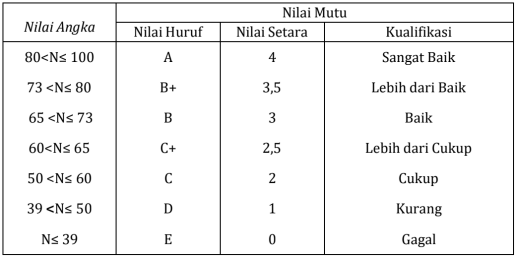

    Jika Nilai Huruf yang didapatkan adalah A, B+, B, C+, C maka LULUS, jika nilai huruf D dan E maka TIDAK LULUS.
    - Input dari program berupa komponen nilai tugas, kuis, UTS, UAS
    - Otuput dari program “nilai tidak valid” jika nilai yang dimasukkan diluar ketentuan
    - Output dari program berupa hasil nilai akhir, nilai huruf, dan keterangan LULUS/TIDAK LULUS
### Jawaban
1. Berikut Kode dan Hasilnya
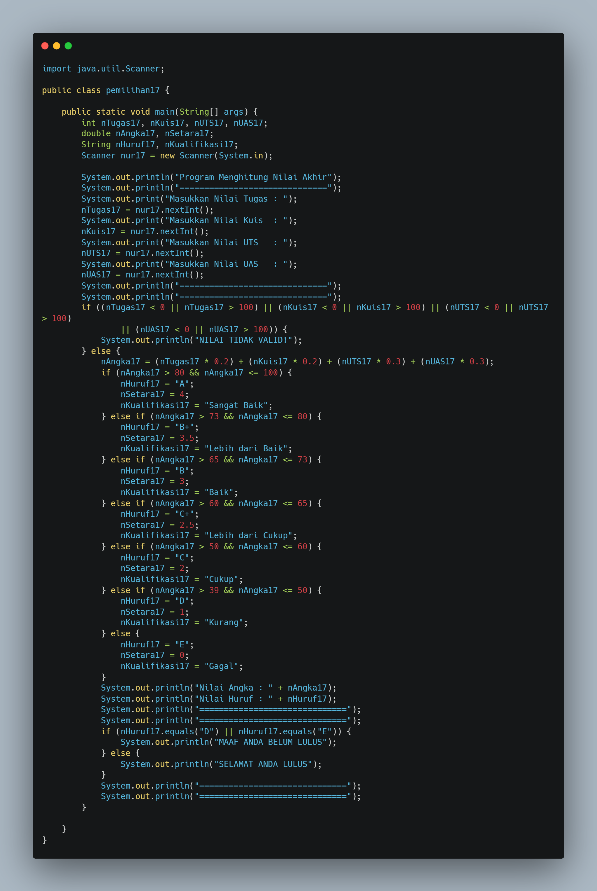
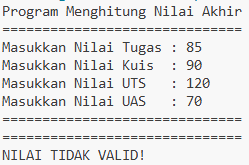
## 2.2 Perulangan
### 2.3.1 Praktikum Perulangan
1. Buatlah program yang dapat menampilkan deretan bilangan dari angka 1 sampai n, dengan
n = 2-digit terakhir NIM Anda. Berikut Adalah ketentuan untuk mencetak deretnya
    - Bilangan kelipatan 3 dicetak dengan simbol #
    - Bilangan genap selain kelipatan 3 dicetak sesuai angkanya
    - Bilangan ganjil dicetak dengan simbol *
    - Bilangan 10 dan 15 tidak dicetak
    *bila n<10 maka tambahkan 10 (n+=10)
    
    Contoh 1: Input NIM: 2541720102 maka n=12
    Output: * 2 # 4 * # * 8 # * #
    
    Contoh 2: Input NIM: 2541720120 maka n=20
    Output: * 2 # 4 * # * 8 # * # * 14 16 * # * 20
### Jawaban
1. Berikut Kode dan Hasilnya
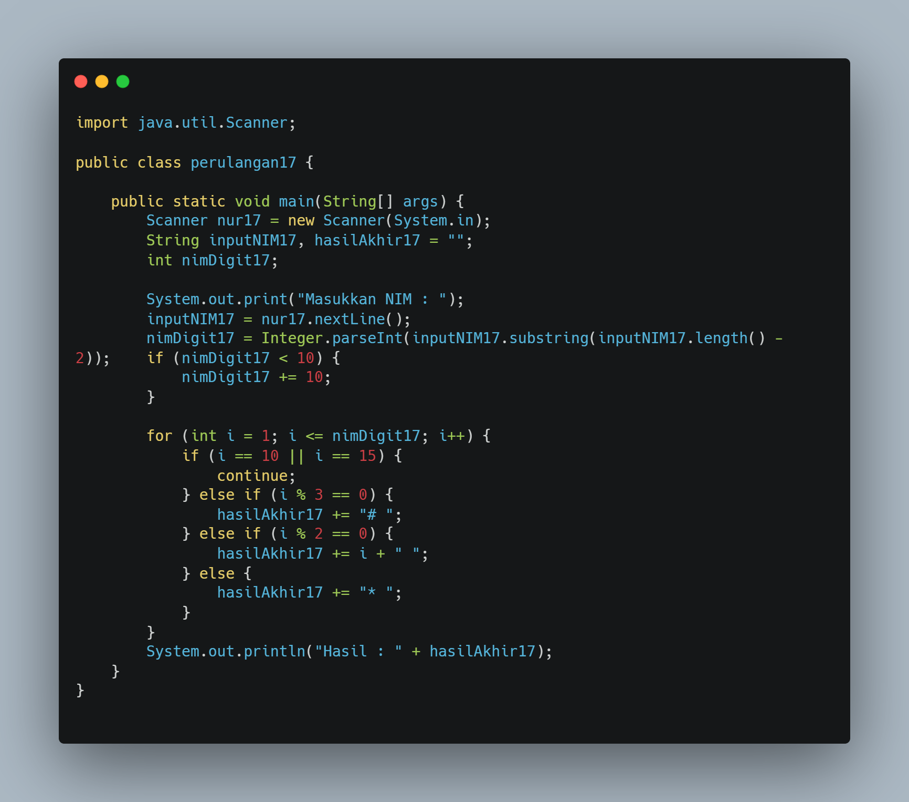
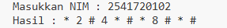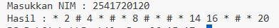
## 2.3 Array
### 2.4.1 Praktikum Array
1. Buatlah program untuk menghitung IP Semester dari mata kuliah yang Anda tempuh
semester lalu. Formula untuk menghitung IP semester sebagai berikut:
𝐼𝑃 𝑆𝑒𝑚𝑒𝑠𝑡𝑒𝑟 = ∑𝑖(𝑁𝑖𝑙𝑎𝑖 𝑆𝑒𝑡𝑎𝑟𝑎𝑖 ∗ 𝑏𝑜𝑏𝑜𝑡 𝑆𝐾𝑆𝑖) / ∑ 𝑆𝐾𝑆

    Nilai setara didapatkan dari tabel konversi berikut ini: 
      
    Input dari program berupa nama mata kuliah, bobot SKS, serta nilai huruf dari mata kuliah tersebut.
### Jawaban
1. Berikut Kode dan Hasilnya
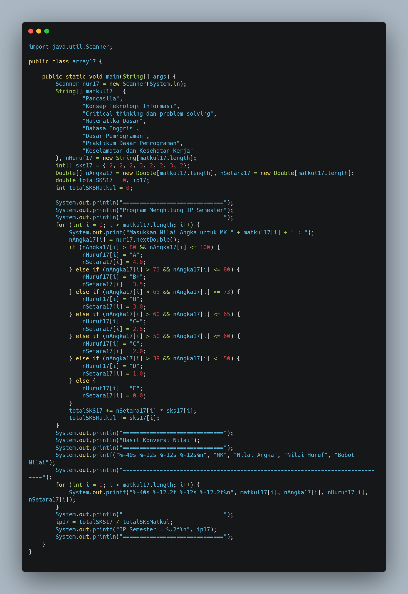
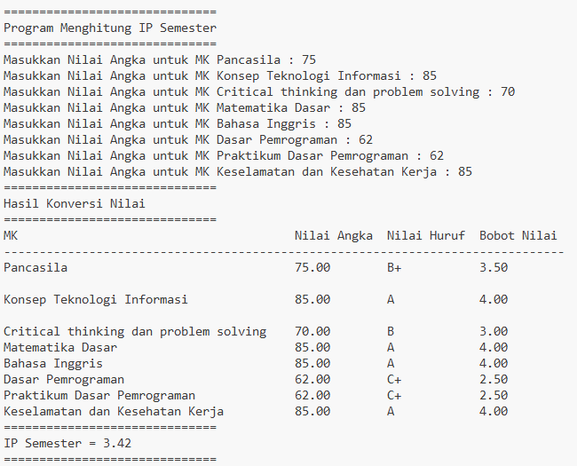
## 2.4 Fungsi
### 2.5.1 Praktikum Fungsi
1. RoyalGarden adalah toko bunga yang memiliki banyak cabang. Setiap hari Stock Bunga dan bungabunga yang dijual selalu dicatat dengan rincian seperti berikut ini:
Baris = Cabang Toko, Kolom = Stock bunga pada hari x
    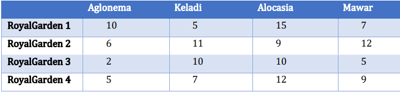
    Rincian Harga Aglonema =75.000, Keladi = 50.000, Alocasia =60.000, Mawar =10.000.
    - Buatlah fungsi untuk menampilkan pendapatan setiap cabang jika semua bunga habis terjual.
    - Tampilkan status dari setiap cabang dengan ketentuan sebagai berikut ini :
    - Jika pendapatan cabang > Rp1.500.000, maka cabang tersebut mendapat status
    “Sangat Baik”
    - Jika pendapatan ≤ Rp1.500.000, status “Perlu Evaluasi”
### Jawaban
1. Berikut Kode dan Hasilnya
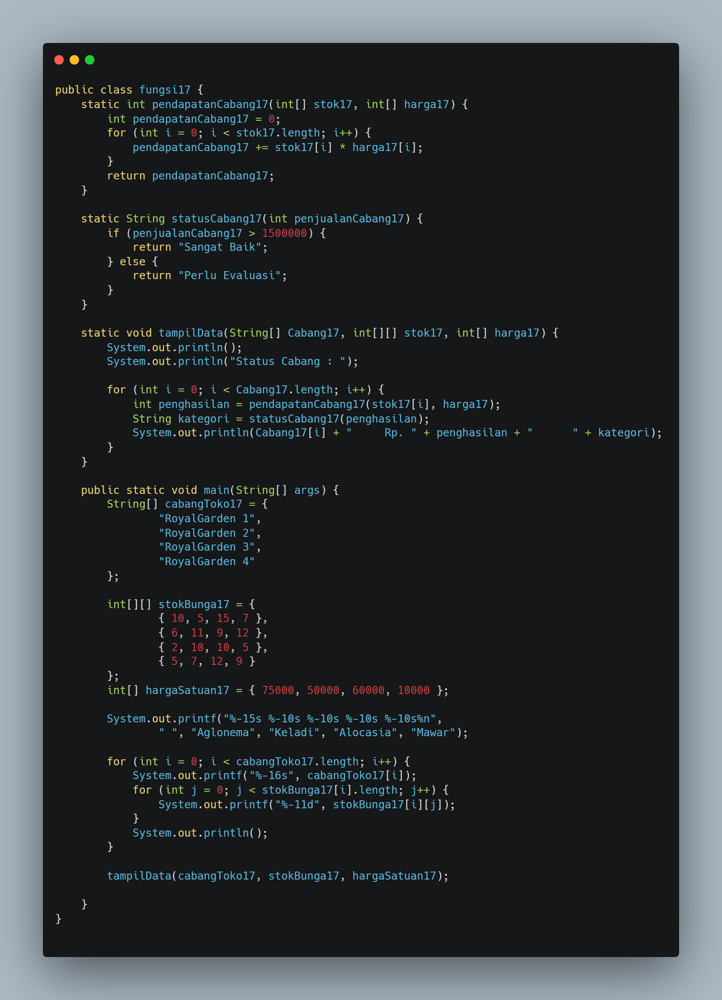
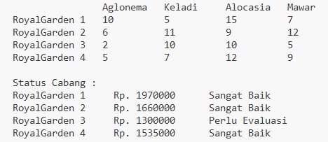
## 3 Tugas
1. Susun program untuk membuat dua buah array berikut isinya sebagai berikut. Array pertama
adalah array satu dimensi char KODE[10], berisi kode plat mobil. Array kedua, array dua
dimensi char KOTA[10][12] berisi nama kota yang berpasangan dengan kode plat mobil.
Ilustrasi tampilan array tersebut adalah sebagai berikut:

    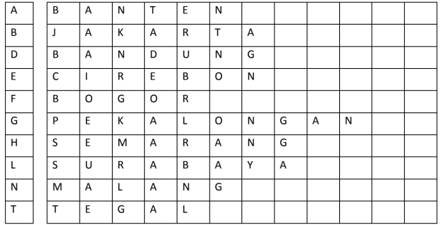

    Ketika pengguna memberikan input kode plat nomor maka program akan mengeluarkan
    nama kota dari kode plat nomor tersebut.

2. Sebuah program digunakan untuk menyimpan dan mengelola jadwal kuliah mahasiswa.
Data jadwal disimpan dalam array 2 dimensi bertipe string, dengan ketentuan
    - Baris menyatakan jadwal ke-i
    - Kolom menyatakan informasi jadwal: Nama Mata Kuliah, Ruang, Hari Kuliah, , Jam
    Kuliah. Contoh :
    jadwal[0][0] = "Pemrograman Dasar"
    jadwal[0][1] = "Lab Komputasi 1"
    jadwal[0][2] = "Senin"
    jadwal[0][3] = "08.00–10.00"
    - Jumlah jadwal kuliah sebanyak n, diinputkan oleh pengguna.

    Buatkan fungsi untuk :
    - Menginput data jadwal kuliah ke dalam array 2 dimensi
    - Menampilkan seluruh jadwal kuliah dalam bentuk tabel
    - Menampilkan jadwal kuliah berdasarkan hari tertentu
    - Menampilkan jadwal kuliah berdasarkan nama mata kuliah tertentu

### Jawaban
1. Berikut Kode dan Hasilnya
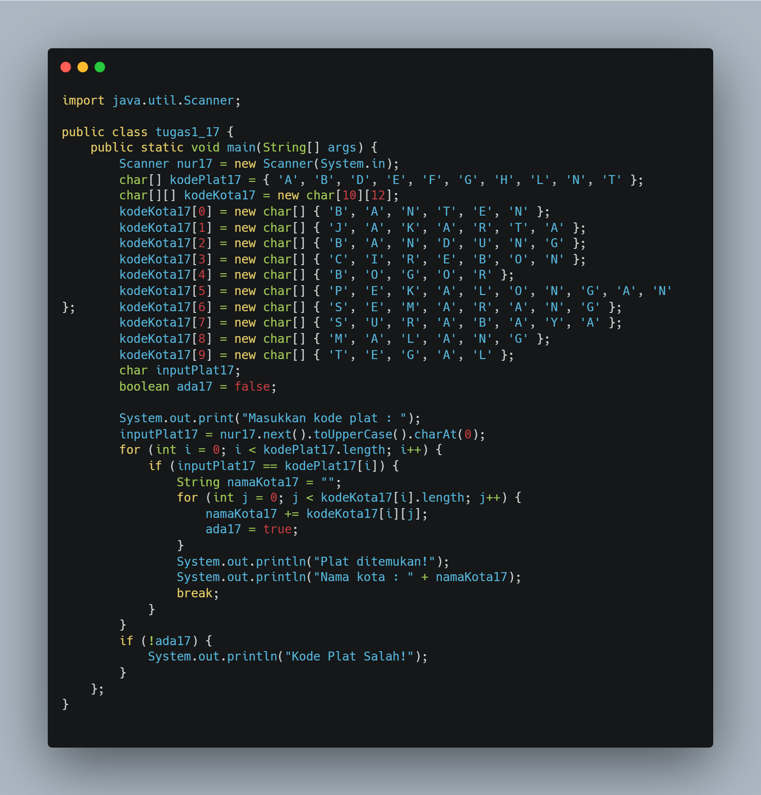
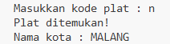
2. Berikut Kode dan Hasilnya
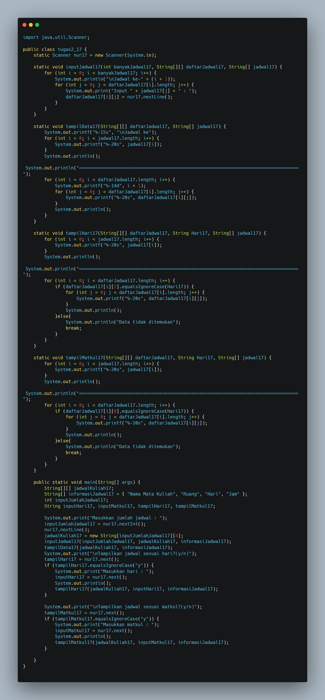
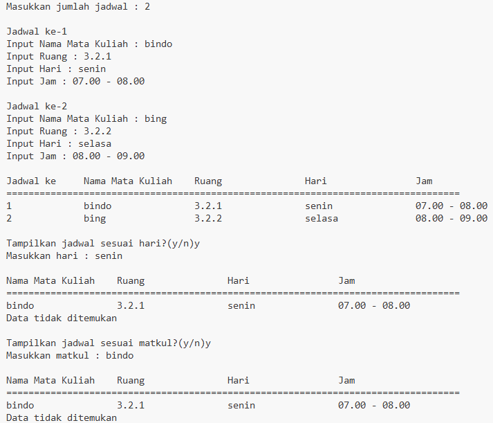

