# Laporan ASD Jobsheet 10

<h4>Nama : Muhammad Nur Rochman<h4>
<h4>NIM : 254107020121<h4>
<h4>Kelas : TI-1E<h4>

## 2.1 Percobaan 1 : Operasi Dasar Queue
### 2.1.1. Langkah-langkah Percobaan

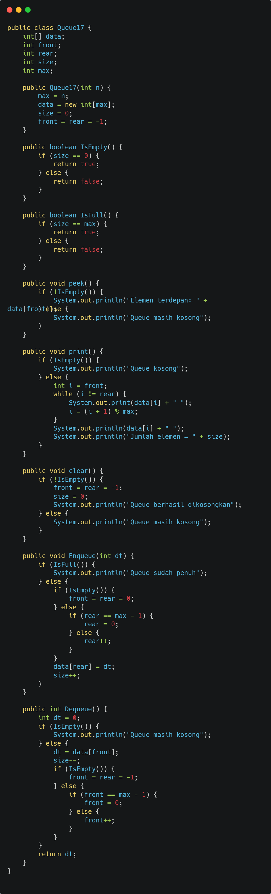

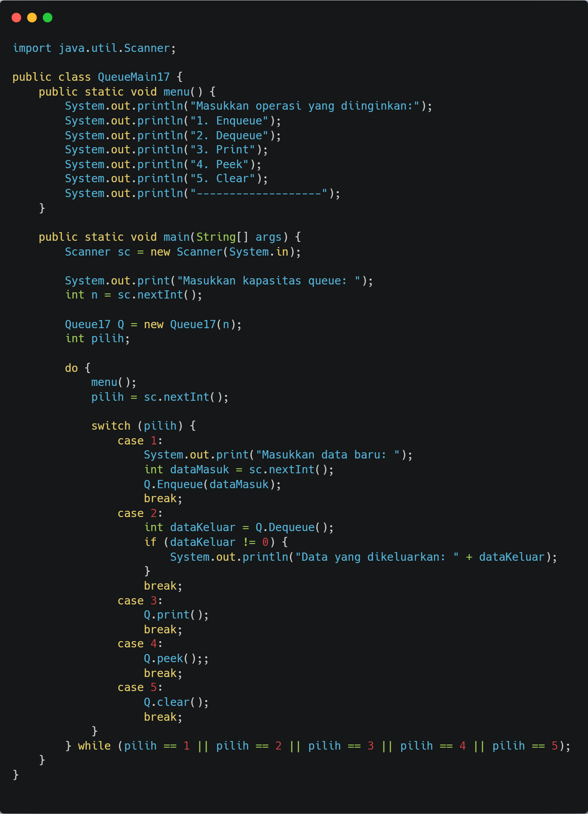

### 2.1.2. Verifikasi Hasil Percobaan

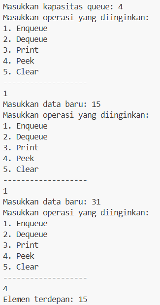

### 2.1.3. Pertanyaan
1. Menandakan queue masih kosong (belum ada data).
2. Menambahkan data ke belakang queue, mengatur posisi rear dan size.
3. Mengambil data dari depan queue dan menggeser posisi front.
4. Karena data dimulai dari posisi front, bukan index 0.
5. Menampilkan semua elemen dari front sampai rear.
6. if (IsFull()) {
        System.out.println("Queue sudah penuh");
    }
7. Tambahkan System.exit(0); di Enqueue() dan Dequeue().
## 2.2. Percobaan 2 : Antrian Layanan Akademik
### 2.2.1. Langkah-langkah Percobaan

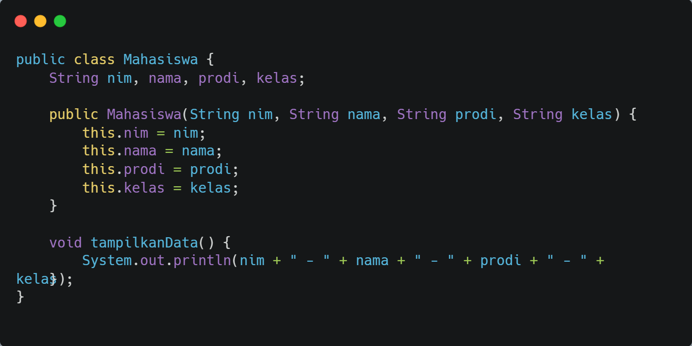

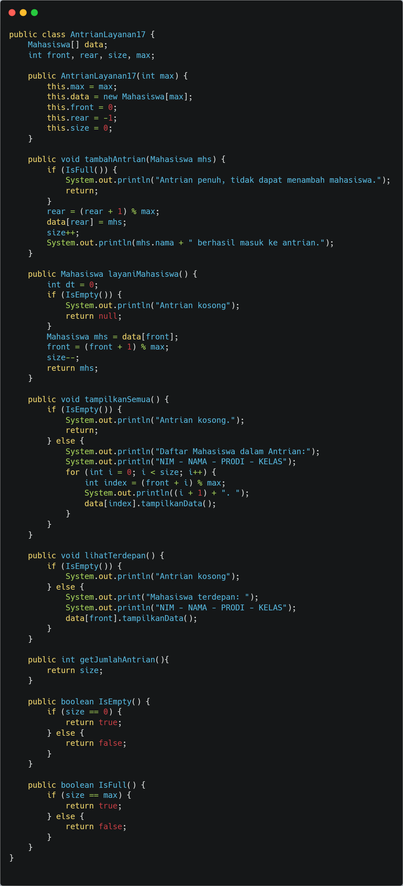

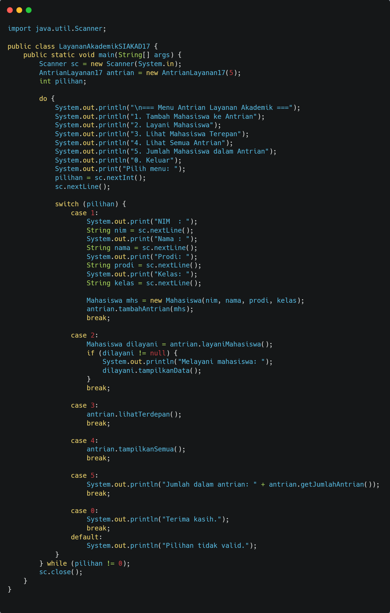

### 2.2.2 Verifikasi Hasil Percobaan

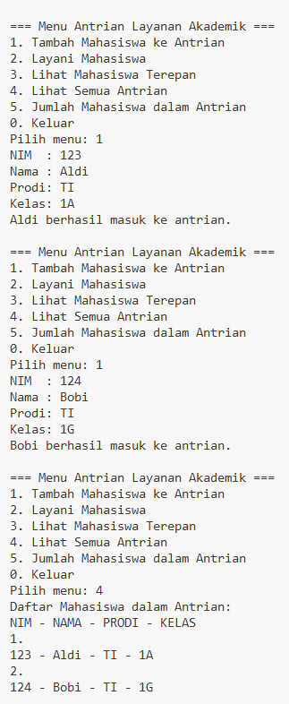

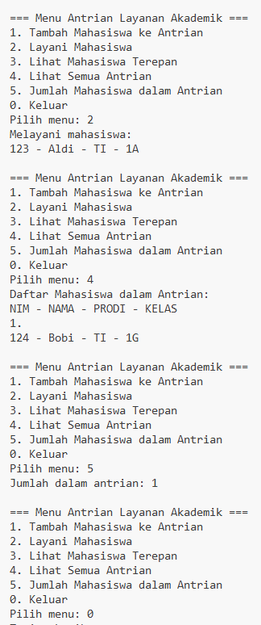

### 2.2.3 Pertanyaan
Tambahkan kode ini di AntrianLayanan17:

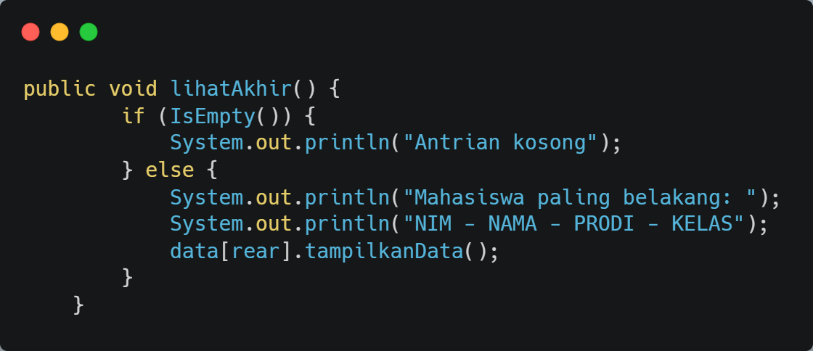

Hasilnya:

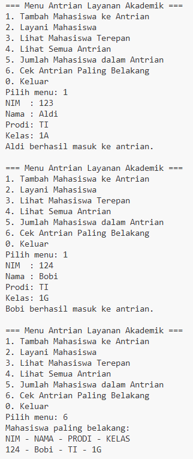

## 2.3 Tugas

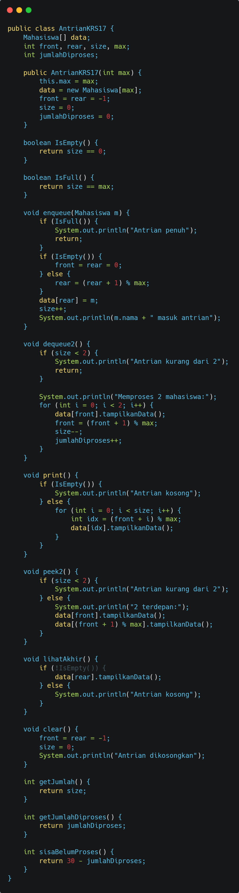

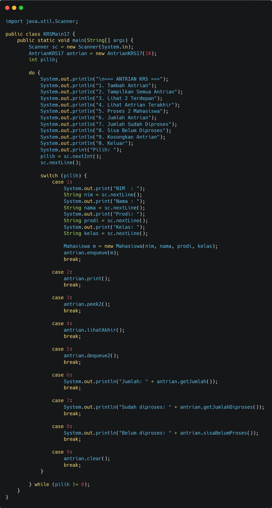

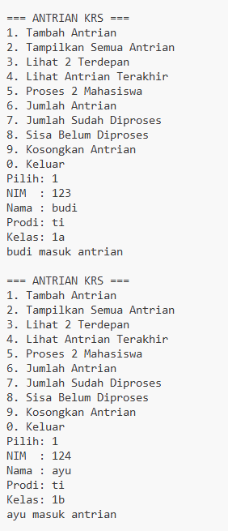

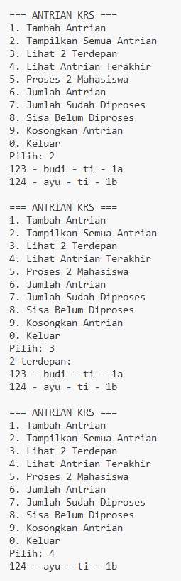

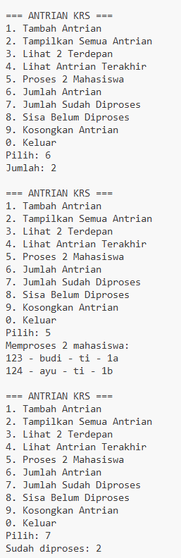

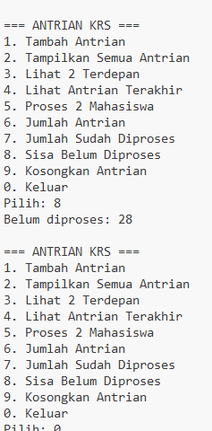