# Laporan ASD Jobsheet 14

<h4>Nama : Muhammad Nur Rochman<h4>
<h4>NIM : 254107020121<h4>
<h4>Kelas : TI-1E<h4>

## 14.2 Kegiatan Praktikum 1

### 14.2.1 Percobaan 1

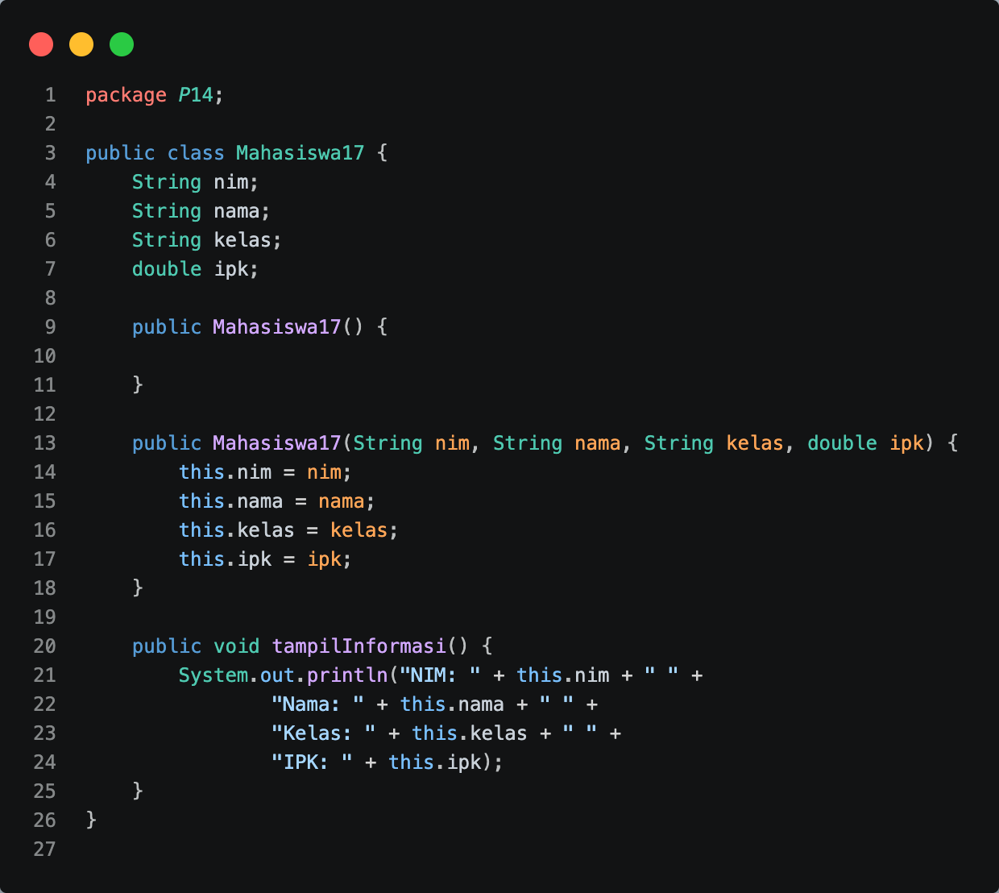

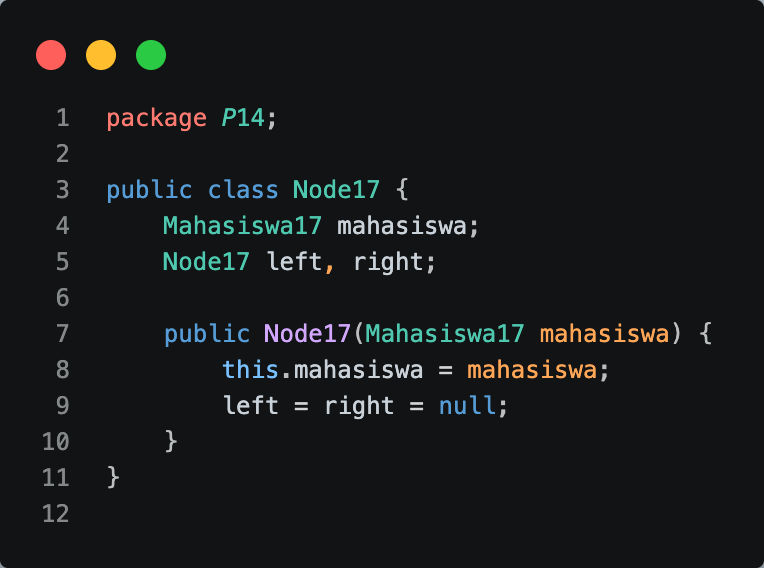

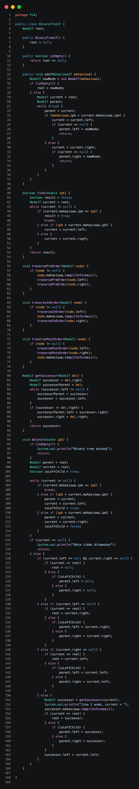

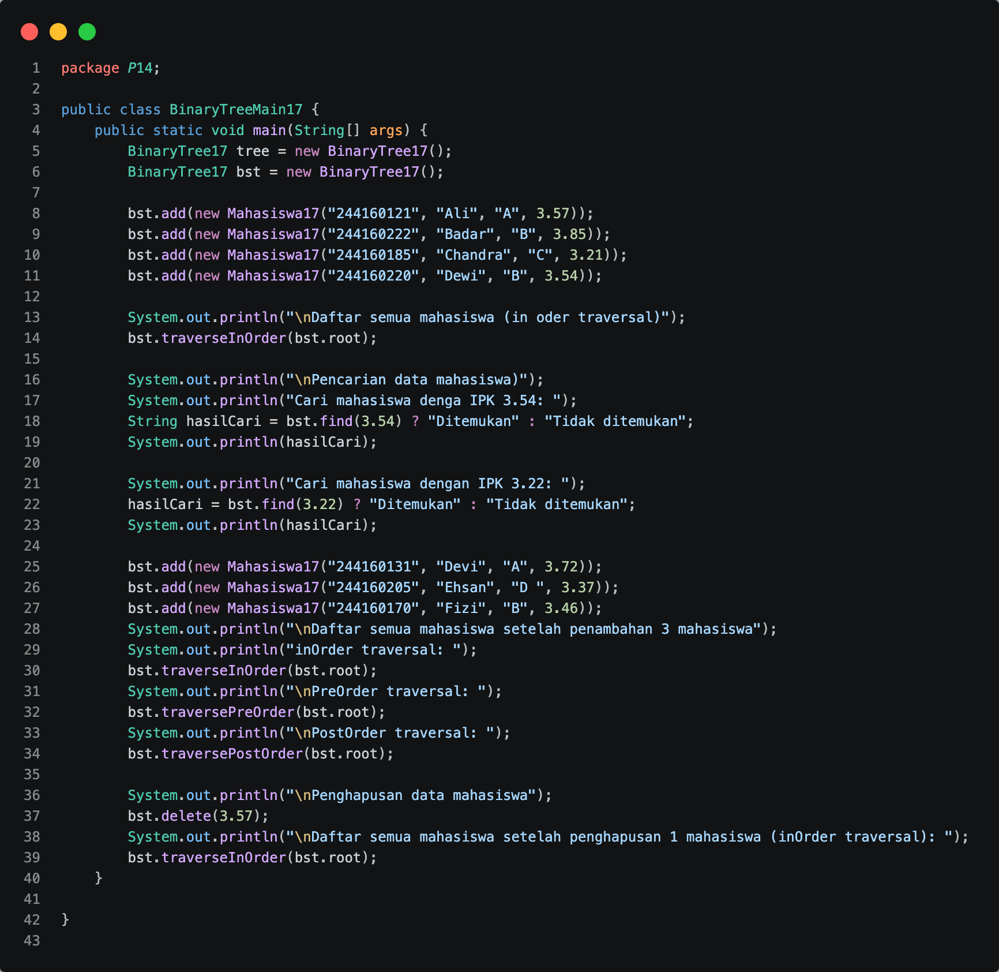

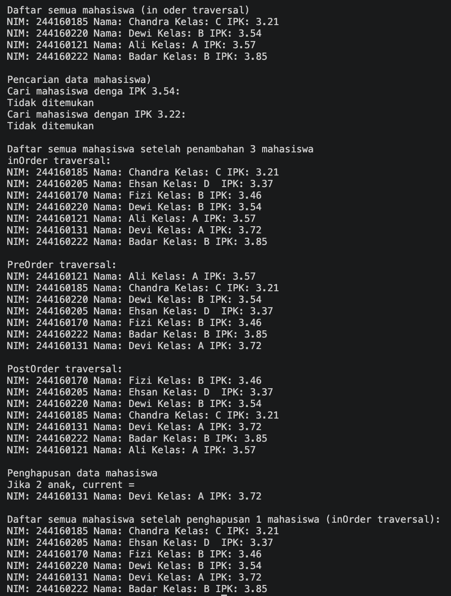

### 14.2.2 Pertanyaan Percobaan

1. Binary Search Tree lebih efektif karena data tersusun terurut.
   Proses pencarian cukup membandingkan nilai lalu bergerak ke kiri atau kanan sehingga lebih cepat dibanding binary tree biasa yang harus mengecek semua node.
2. - left digunakan untuk menunjuk child kiri.
   - right digunakan untuk menunjuk child kanan.
     Kedua atribut dipakai untuk traversal dan penyimpanan struktur tree.
3. - root berfungsi sebagai node awal atau akar dari binary tree.
   - Saat object tree pertama dibuat, nilai root adalah null.
4. Saat tree kosong: node baru akan langsung menjadi root.
5. - parent = current;
     Menyimpan node saat ini sebagai parent (induk).
   - if (mahasiswa.ipk < current.mahasiswa.ipk)
     Mengecek apakah IPK yang ditambahkan lebih kecil dari node saat ini.
   - current = current.left;
     Berpindah ke child kiri karena nilainya lebih kecil.
   - if (current == null)
     Mengecek apakah posisi kiri masih kosong.
   - parent.left = newNode;
     Menambahkan node baru sebagai child kiri.
   - else { current = current.right; }
     Jika IPK lebih besar atau sama, berpindah ke child kanan.
   - if (current == null)
     Mengecek apakah posisi kanan masih kosong.
   - parent.right = newNode;
     Menambahkan node baru sebagai child kanan.
6. Langkah delete node dengan 2 child:
   - Cari node pengganti (successor).
   - Successor diambil dari subtree kanan paling kiri.
   - Ganti node yang dihapus dengan successor.
   - Sambungkan kembali child kiri dan kanan.
   Method getSuccessor() membantu mencari node pengganti tersebut.

## 14.3 Kegiatan Praktikum 2

### 14.3.1 Tahapan Percobaan

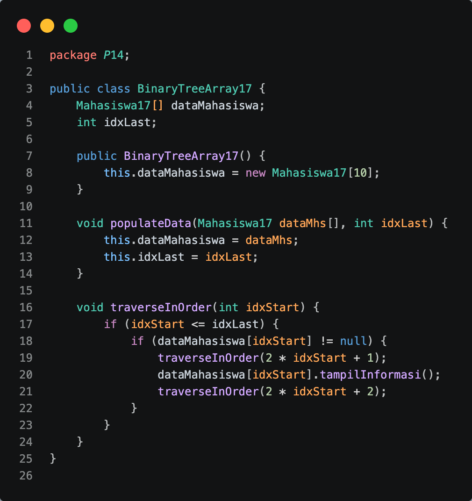

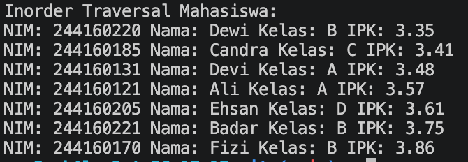

### 14.3.2 Pertanyaan Percobaan
1. - data digunakan untuk menyimpan seluruh node pohon biner dalam bentuk array.
   - idxLast digunakan untuk menyimpan indeks terakhir yang berisi data pada array, sehingga program mengetahui batas data yang 
     akan diproses saat traversal.
2. Method populateData() digunakan untuk mengisi array data dengan data node pohon biner serta menentukan nilai idxLast. Dengan 
   method ini, data pohon dapat dimasukkan ke dalam array sebelum dilakukan operasi seperti traversal.
3. Method traverseInOrder() digunakan untuk menampilkan atau mengunjungi node pohon biner dengan urutan InOrder, yaitu:
   Left Child → Root → Right Child
   Traversal ini sering digunakan untuk menampilkan data pohon secara terurut.
4. Pada representasi pohon biner menggunakan array:
   - Left Child = 2 × indeks + 1
   - Right Child = 2 × indeks + 2
   Jika node berada pada indeks 2:
   - Left Child = (2 × 2) + 1 = 5
   - Right Child = (2 × 2) + 2 = 6
   Jadi:
   - Left Child berada pada indeks 5
   - Right Child berada pada indeks 6
5. digunakan untuk menunjukkan bahwa data terakhir pada array berada di indeks ke-6. Dengan demikian, traversal hanya akan 
   memproses elemen dari indeks 0 sampai 6 dan mengabaikan indeks setelahnya yang belum berisi data.
6. Karena pada representasi binary tree menggunakan array, indeks 2*idxStart+1 menunjukkan posisi anak kiri, sedangkan 2*idxStart
   +2 menunjukkan posisi anak kanan dari suatu node. Oleh karena itu, indeks tersebut digunakan agar proses rekursif dapat mengunjungi seluruh node sesuai struktur pohon biner.

## 14.4 Tugas Praktikum

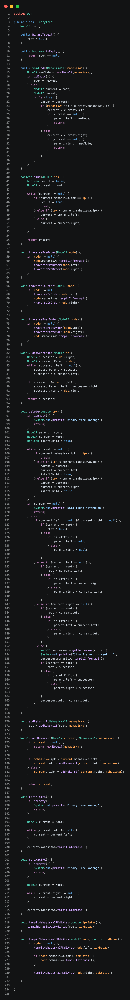

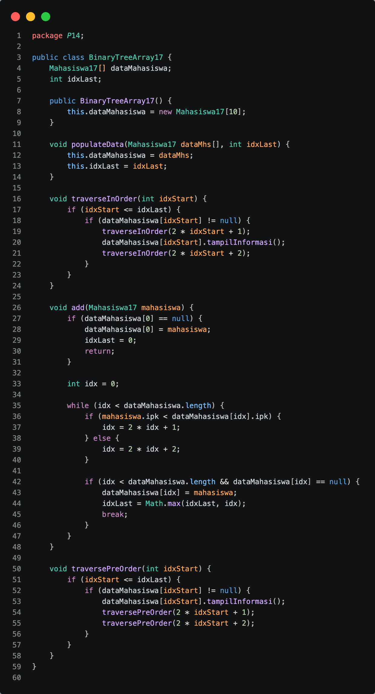

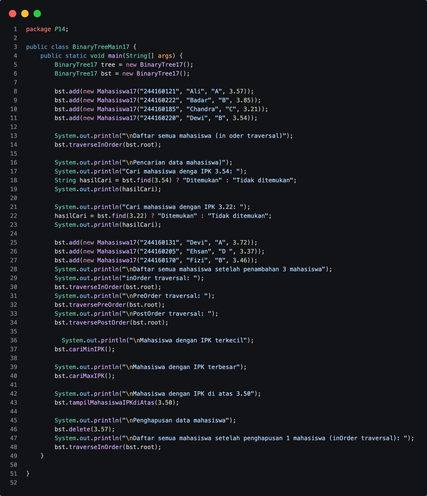

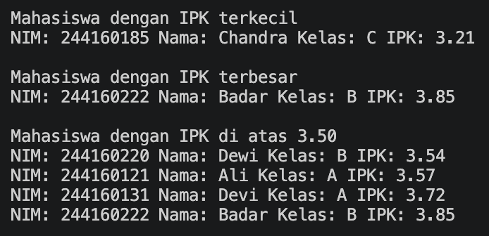