# Laporan ASD Jobsheet 16

<h4>Nama : Muhammad Nur Rochman<h4>
<h4>NIM : 254107020121<h4>
<h4>Kelas : TI-1E<h4>

## 16.2. Kegiatan Praktikum 1

### 16.2.1. Percobaan 1

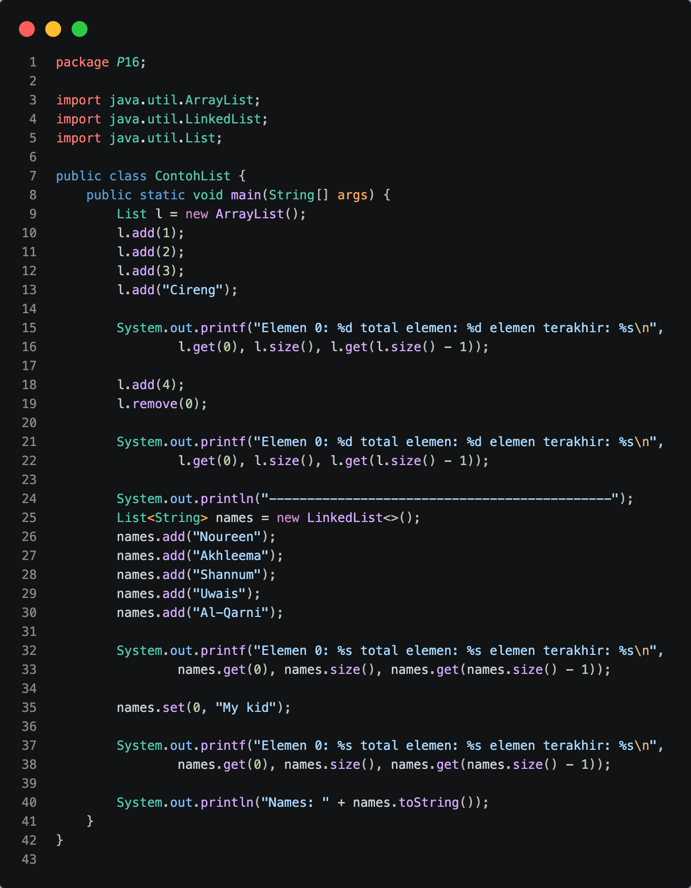

### 16.2.2. Verifikasi Hasil Percobaan

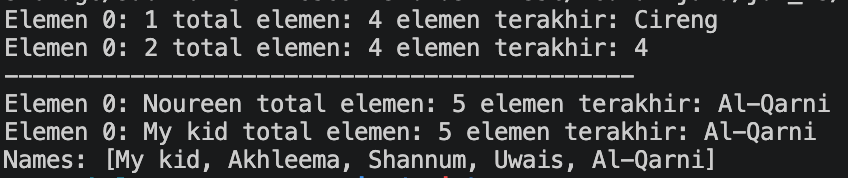

### 16.2.3. Pertanyaan Percobaan

1. Jawaban: Karena objek ArrayList tersebut dideklarasikan secara mentah (raw type) tanpa menggunakan Generic (tanda <T>). Di dalam Java, jika kita tidak menentukan tipe data penampungnya secara spesifik, maka secara otomatis ArrayList akan menganggap semua elemen yang dimasukkan sebagai objek dari class tertinggi, yaitu java.lang.Object. Karena semua tipe data (termasuk primitive lewat proses autoboxing) merupakan turunan dari Object, maka jenis data apa saja bisa masuk ke dalam satu List yang sama.
2. kode

   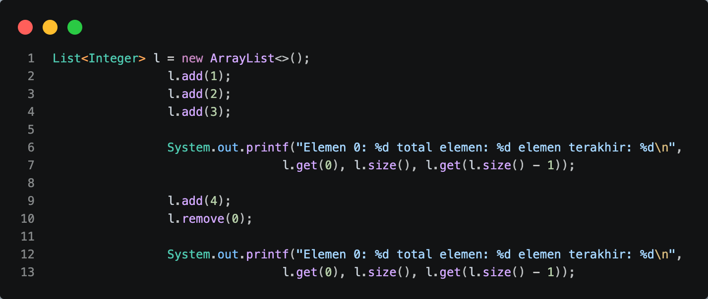

   hasil

   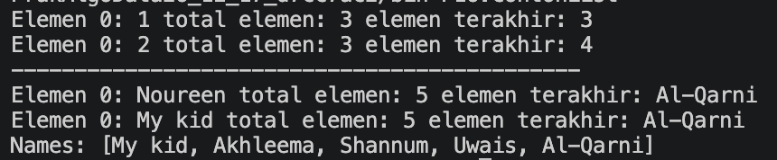

3. kode

   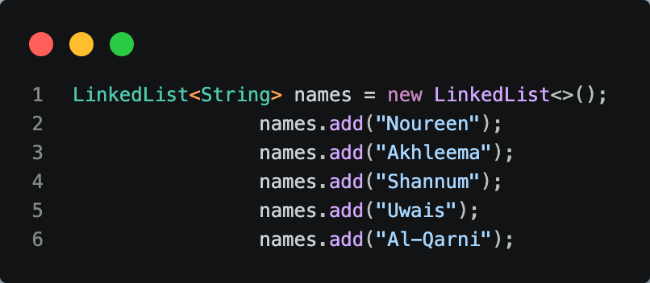

4. kode

   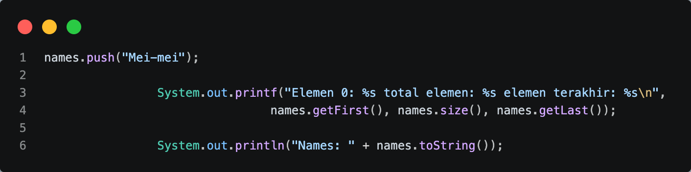

5. hasil

   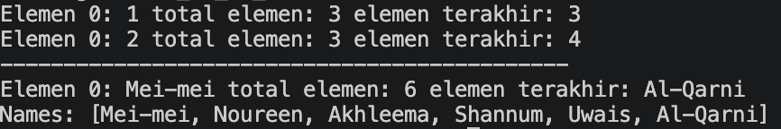

   Penjelasan
   - Mengubah tipe menjadi LinkedList<String> memungkinkan penggunaan method spesifik dari struktur data Stack/Queue (seperti push(), getFirst(), dan getLast()) yang tidak tersedia jika menggunakan interface List biasa.
   - Method push() menerapkan prinsip LIFO (Last In First Out), sehingga data baru ("Mei-mei") dimasukkan ke posisi paling awal (indeks 0/head). Hal ini menggeser elemen lainnya ke belakang dan menambah total elemen menjadi 6.

## 16.3. Kegiatan Praktikum 2

### 16.3.1. Tahapan Percobaan

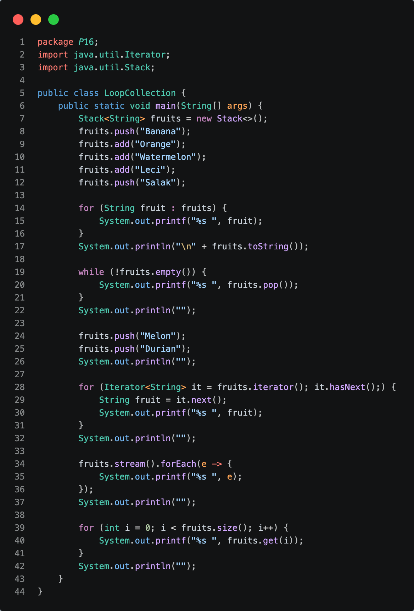

### 16.3.2. Verifikasi Hasil Percobaan

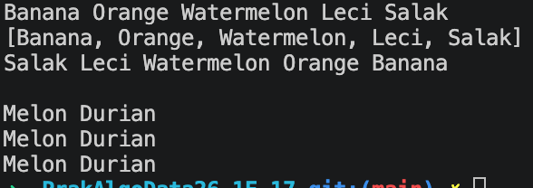

### 16.3.3. Pertanyaan Percobaan

1. push() adalah method asli Stack untuk memasukkan elemen ke atas tumpukan, sedangkan add() adalah method warisan dari Collection untuk menyisipkan elemen di posisi paling akhir (seperti list biasa).
2. Output perulangan di bawahnya akan kosong karena data pada fruits sudah habis dikuras oleh perintah pop() di baris sebelumnya. Jika pengisian ulang (baris 43 & 44) dihapus, objek fruits tetap kosong.
3. Berfungsi untuk menampilkan seluruh elemen di dalam koleksi secara berurutan menggunakan objek Iterator lewat perulangan hasNext() dan next().
4. Berfungsi untuk menampilkan seluruh elemen di dalam koleksi secara berurutan menggunakan objek Iterator lewat perulangan hasNext() dan next().
5. No 5 dan 6
   Kode

   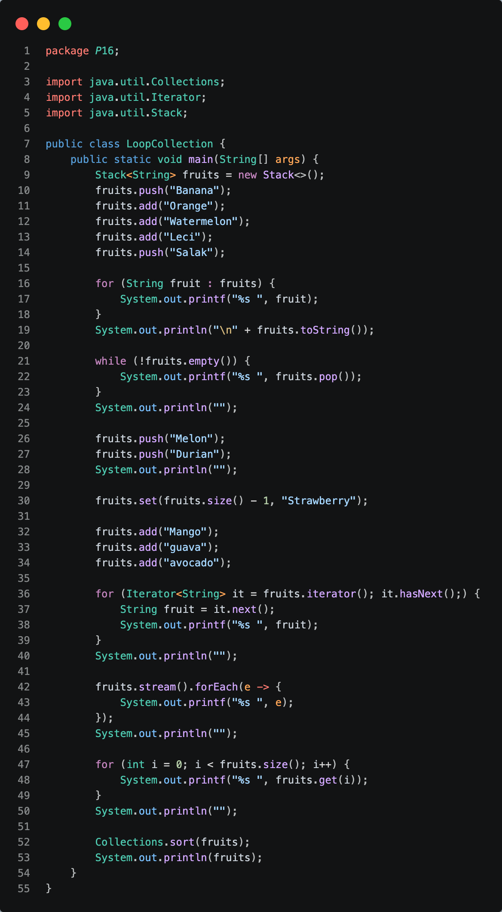

   hasil

   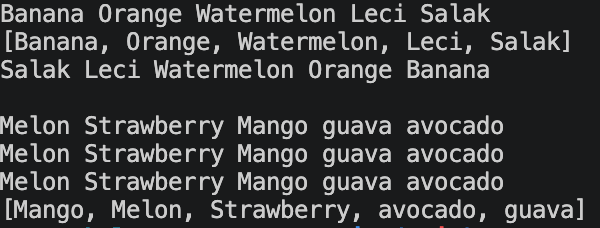

## 16.4. Kegiatan Praktikum 3

### 16.4.1. Tahapan Percobaan

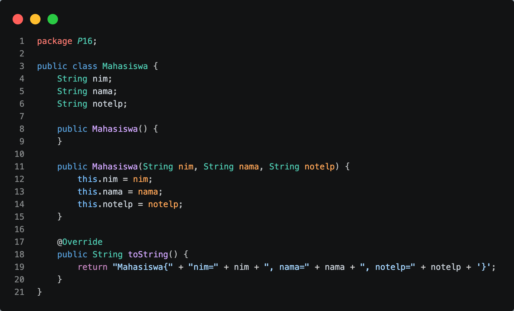

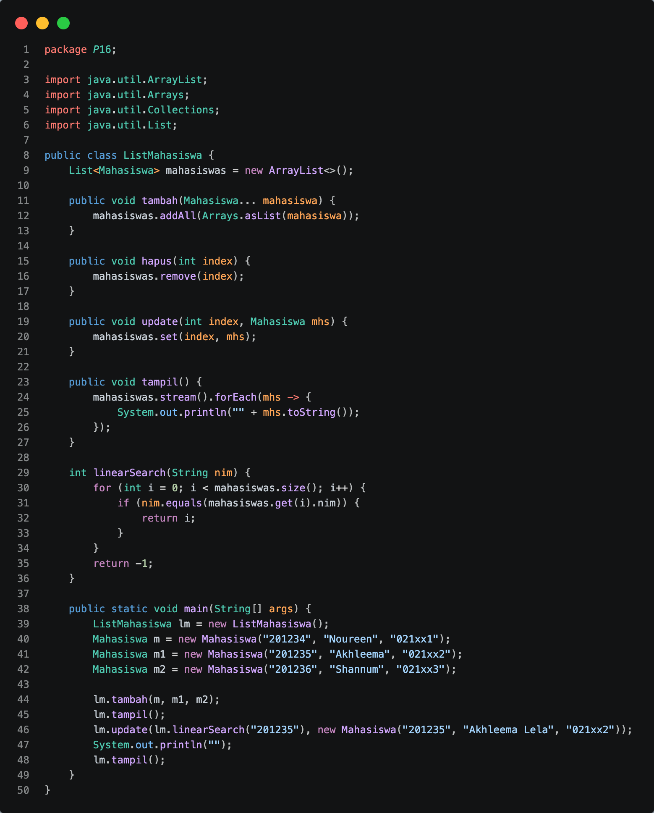

### 16.4.2. Verifikasi Hasil Percobaan

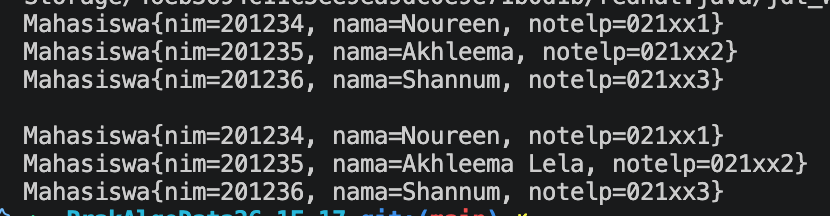

### 16.4.3. Pertanyaan Percobaan

1. Konsep: Varargs (Variable Arguments).
   Kelebihan: Memungkinkan sebuah method untuk menerima parameter atau argumen dengan jumlah yang dinamis (bisa satu atau banyak sekaligus) tanpa perlu membungkus elemen-elemen tersebut ke dalam bentuk array secara manual terlebih dahulu sebelum dimasukkan ke dalam parameter fungsi.
2. kode
   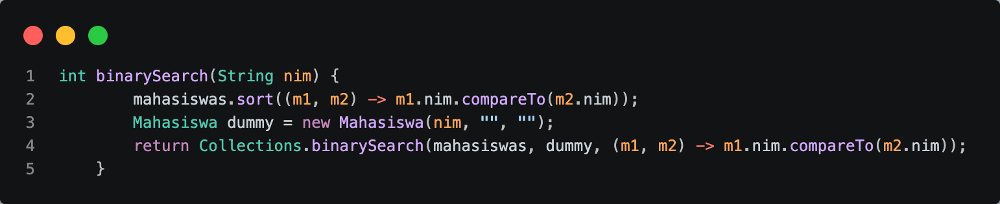

   hasil
   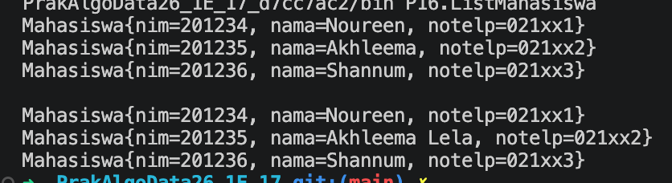

3. kode
   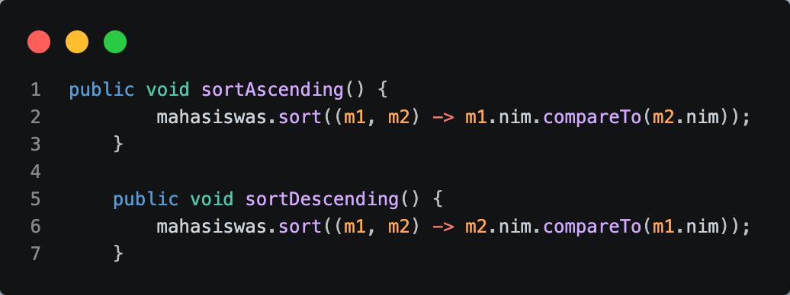

   hasil
   

## 16.5. Tugas Praktikum

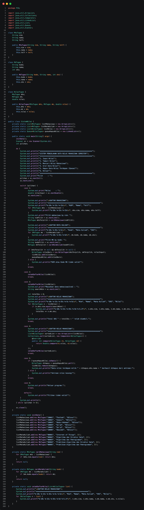
