# Laporan Praktikum Dasar Pemrograman Jobsheet 2

<h4>Nama : Muhammad Nur Rochman<h4>
<h4>NIM : 254107020121<h4>
<h4>Kelas : TI-1E<h4>

## 2.1 Percobaan 1 : Deklarasi Class, Atribut dan Method

### 2.1.2 Verifikasi Hasil Percobaan

Berikut Kode dan Hasilnya :

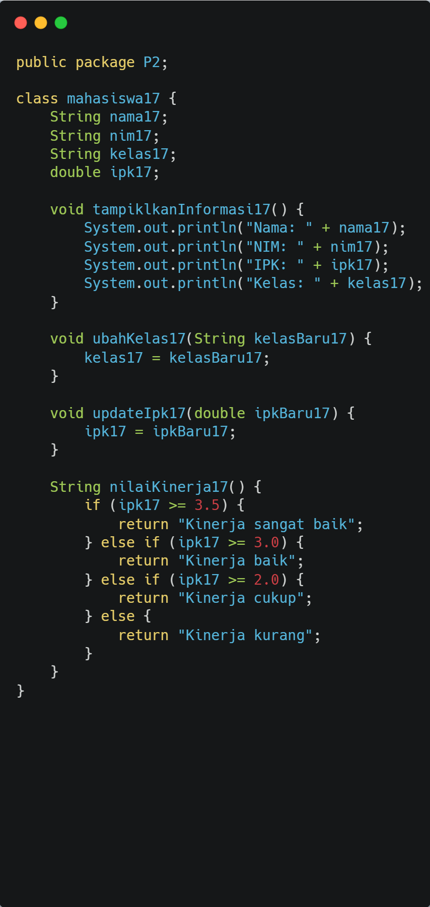

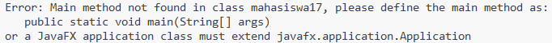

### 2.1.3 Pertanyaan

1. Sebutkan dua karakteristik class atau object!
2. Perhatikan class Mahasiswa pada Praktikum 1 tersebut, ada berapa atribut yang dimiliki oleh class
   Mahasiswa? Sebutkan apa saja atributnya!
3. Ada berapa method yang dimiliki oleh class tersebut? Sebutkan apa saja methodnya!
4. Perhatikan method updateIpk() yang terdapat di dalam class Mahasiswa. Modifikasi isi method
   tersebut sehingga IPK yang dimasukkan valid yaitu terlebih dahulu dilakukan pengecekan apakah
   IPK yang dimasukkan di dalam rentang 0.0 sampai dengan 4.0 (0.0 <= IPK <= 4.0). Jika IPK tidak
   pada rentang tersebut maka dikeluarkan pesan: "IPK tidak valid. Harus antara 0.0 dan 4.0".
5. Jelaskan bagaimana cara kerja method nilaiKinerja() dalam mengevaluasi kinerja mahasiswa,
   kriteria apa saja yang digunakan untuk menentukan nilai kinerja tersebut, dan apa yang
   dikembalikan (di-return-kan) oleh method nilaiKinerja() tersebut?
6. Commit dan push kode program ke Github

### Jawaban

1. Atribut dan method
2. Memiliki 4 atribut : String nama17, String nim17, String kelas17, double ipk17
3. Memiliki 4 method : void tampiklkanInformasi17(), void ubahKelas17(String kelasBaru17), void updateIpk17(double ipkBaru17), String nilaiKinerja17()
4. Berikut hasil modifikasinya :

   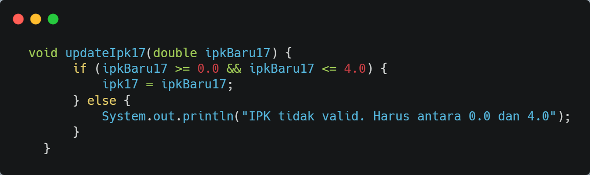

5. Method nilaiKinerja17() bekerja mengevaluasi kinerja dari mahasiswa berdasarkan nilai ipk-nya, berikut kriteria penilaiannya:
   - ipk >= 3.5 "Kinerja sangat baik"
   - ipk >= 3.0 "Kinerja baik"
   - ipk >= 2.0 "Kinerja cukup"
   - ipk < 2.0 "Kinerja kurang"
6. Commit and push

   

   

## Percobaan 2 : Instansiasi Object, serta Mengakses Atribut dan Method

### 2.2.2 Verifikasi Hasil Percobaan

Berikut Kode dan Hasilnya :

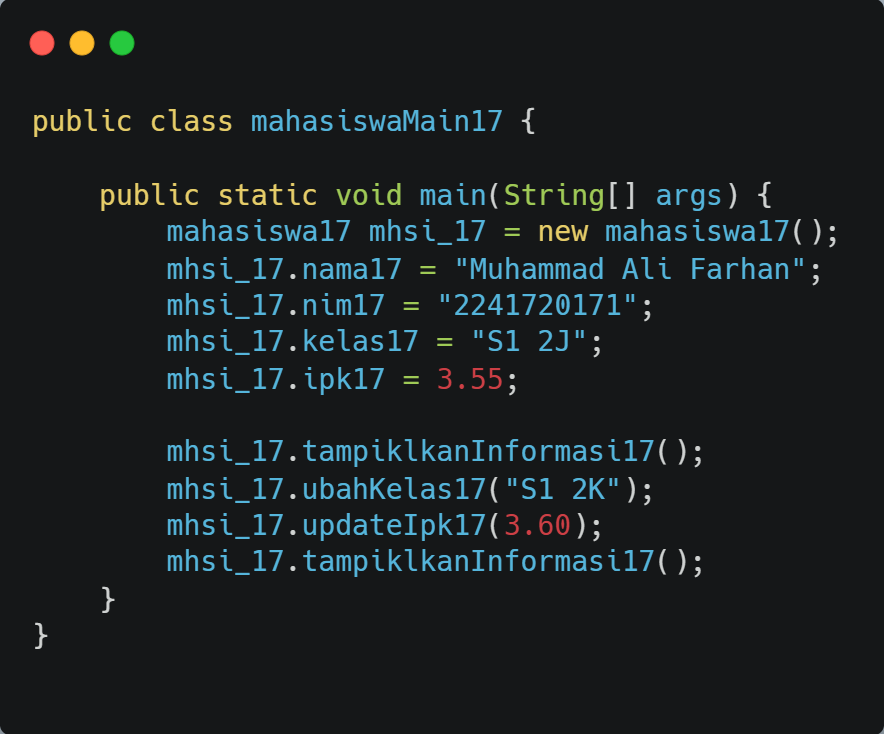

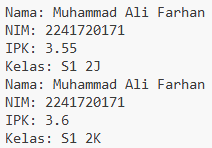

### 2.2.3 Pertanyaan

1. Pada class MahasiswaMain, tunjukkan baris kode program yang digunakan untuk proses
   instansiasi! Apa nama object yang dihasilkan?
2. Bagaimana cara mengakses atribut dan method dari suatu objek?
3. Mengapa hasil output pemanggilan method tampilkanInformasi() pertama dan kedua berbeda?

### Jawaban

1. mahasiswa17 mhsi_17 = new mahasiswa17(); nama objek yang dihasilkan adalah mhsi_17
2. - mengaksses atribut contoh : mhsi_17.nama17 = "Muhammad Ali Farhan";
   - cara mengakses method contoh : mhsi_17.tampiklkanInformasi17();
3. karena nilai atribut objek diubah. dibagian ini
   - mhsi_17.ubahKelas17("S1 2K");
   - mhsi_17.updateIpk17(3.60);

   nanti tampiklkanInformasi17() akan menampilkan data terbaru

## Percobaan 3 : Membuat Konstruktor

### 2.3.2 Verifikasi Hasil Percobaan

Berikut Kode dan Hasilnya :
penambahan kode di file mahasiswa17:

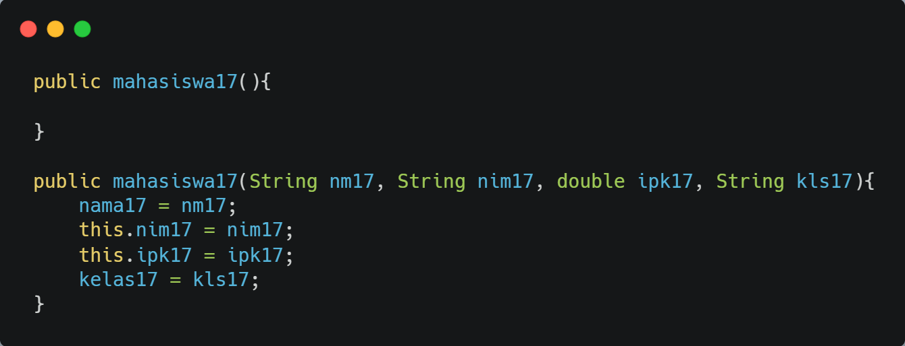

penambahan kode di file mahasiswaMain17 :

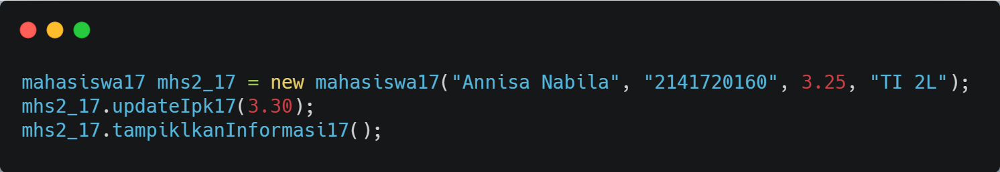

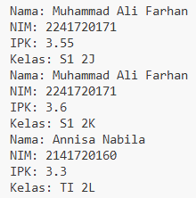

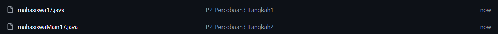

### 2.3.3 Pertanyaan

1. Pada class Mahasiswa di Percobaan 3, tunjukkan baris kode program yang digunakan untuk mendeklarasikan konstruktor berparameter!
2. Perhatikan class MahasiswaMain. Apa sebenarnya yang dilakukan pada baris program berikut?
   mahasiswa17 mhs2_17 = new mahasiswa17("Annisa Nabila", "2141720160", 3.25, "TI 2L");
3. Hapus konstruktor default pada class Mahasiswa, kemudian compile dan run program. Bagaimana hasilnya? Jelaskan mengapa hasilnya demikian!
4. Setelah melakukan instansiasi object, apakah method di dalam class Mahasiswa harus diakses secara berurutan? Jelaskan alasannya!
5. Buat object baru dengan nama mhs<NamaMahasiswa> menggunakan konstruktor berparameter dari class Mahasiswa!
6. Commit dan push kode program ke Github

### Jawaban

1. Pada baris kode berikut :

   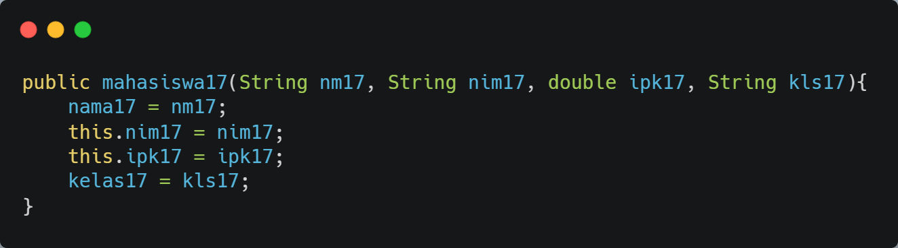

2. Objek mhs2_17 dibuat dari class mahasiswa17 dengan memanfaatkan konstruktor berparameter untuk memberikan nilai awal pada atribut nama, NIM, IPK, dan kelas.
3. Hasilnya error karena pada mahasiswa17 mhsi_17 = new mahasiswa17(); memanggil konstruktor tanpa parameter sedangkan Konstruktor default sudah dihapus.
4. Tidak, karena method itu mandiri/independen jadi bisa dipanggil sesuai kebutuhan
5. Berikut kodenya :

   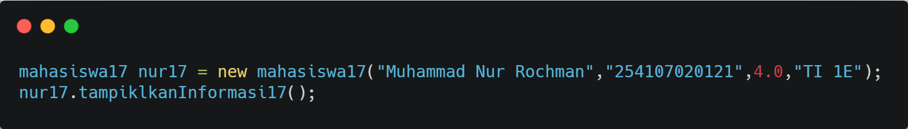

6. Commit and push :

   

## Latihan Praktikum

1. Diberikan class diagram dari class MataKuliah sebagai berikut:

   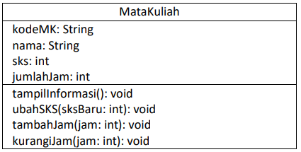

   Buat program untuk mengimplementasikan class MataKuliah berdasarkan class diagram di atas,
   yang terdiri dari:
   - Class MataKuliah (MataKuliah<NoAbsen>.java)
   - Class MataKuliahMain (MataKuliahMain<NoAbsen>.java)

   Pada class MataKuliahMain buatlah minimal 2 objek. Gunakan konstruktor default dan 
   konstruktor berparameter saat mengintansiasi objek. Lalu panggil semua method yang sudah dibuat pada class MataKuliah.

   Penjelasan dari atribut dan method pada class MataKuliah tersebut adalah sebagai berikut:

   a. Atribute 
   - kodeMK (String): kode unik untuk mata kuliah. 
   - nama (String): nama lengkap dari mata kuliah 
   - sks (int): SKS (Satuan Kredit Semester) 
   - jumlahJam (int): jumlah total jam pertemuan per minggu untuk mata kuliah

   b. Method 
   - tampilInformasi(): method ini digunakan untuk menampilkan semua informasi yang berkaitan dengan mata kuliah. 
   - ubahSKS(int sksBaru): method ini memungkinkan pengubahan nilai SKS untuk mata
   kuliah. Setelah mengubah nilai, method ini memberi tahu pengguna bahwa SKS telah
   diubah. 
   - tambahJam(int jam): method ini menambahkan jumlah jam tambahan ke jumlah jam
   yang sudah ada untuk mata kuliah.
   - kurangiJam(int jam): method ini berfungsi untuk mengurangi jumlah jam dari mata kuliah. Sebelum mengurangi, method ini melakukan pengecekan untuk memastikan
   bahwa jumlah jam yang tersisa cukup untuk dikurangi. Jika jumlah jam tidak mencukupi (jumlah jam awal lebih kecil dari jam pengurang), method ini akan memberi tahu 
   pengguna bahwa pengurangan tidak dapat dilakukan. Jika pengurangan berhasil, method ini mengupdate jumlah jam dan mencetak nilai jumlah jam yang baru.

2. Diberikan class diagram dari class Dosen sebagai berikut:

   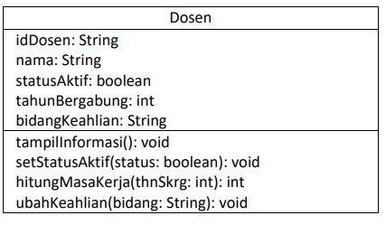

   Buat program untuk mengimplementasikan class Dosen berdasarkan class diagram di atas, yang terdiri dari:
   - Class Dosen (Dosen<NoAbsen>.java)
   - Class DosenMain (DosenMain<NoAbsen>.java)

   Pada class DosenMain buatlah minimal 2 objek. Gunakan konstruktor default dan konstruktor berparameter saat mengintansiasi objek. Lalu panggil semua method yang sudah dibuat pada class Dosen. 

   Penjelasan dari atribut dan method pada class Dosen tersebut adalah sebagai berikut:

   a. Atribute 
   - idDosen (String): id unik untuk setiap dosen. 
   - nama (String): nama lengkap dari dosen. 
   - statusAktif (boolean): menunjukkan apakah dosen tersebut aktif (true) atau tidak aktif (false) dalam menjalankan tugasnya.
   - tahunBergabung (int): tahun ketika dosen mulai bergabung dengan perguruan tinggi
   -bidangKeahlian (String): bidang keahlian dosen, yang menjelaskan spesialisasi atau fokus akademik dosen

   b. Method 
   - tampilInformasi(): method ini digunakan untuk menampilkan informasi lengkap tentang dosen
   - setStatusAktif(status: boolean): method ini digunakan untuk mengatur status aktif dosen. Jika parameter status diatur ke true, 
   berarti dosen tersebut menjadi aktif. Sebaliknya, jika false, dosen tersebut dinyatakan tidak aktif
   - hitungMasaKerja(thnSkrg: int): method ini menghitung dan mengembalikan (me-returnkan) masa kerja dosen dalam tahun, berdasarkan tahun bergabung dan tahun saat ini
   (thnSkrg) yang menjadi parameter input method ini. Hasil perhitungan memberikan informasi tentang lamanya dosen bekerja di perguruan tinggi.
   - ubahKeahlian(bidang: String): method ini digunakan untuk mengubah bidang keahlian dosen.

   ### Jawaban
   1. Berikut kode dan hasilnya :

      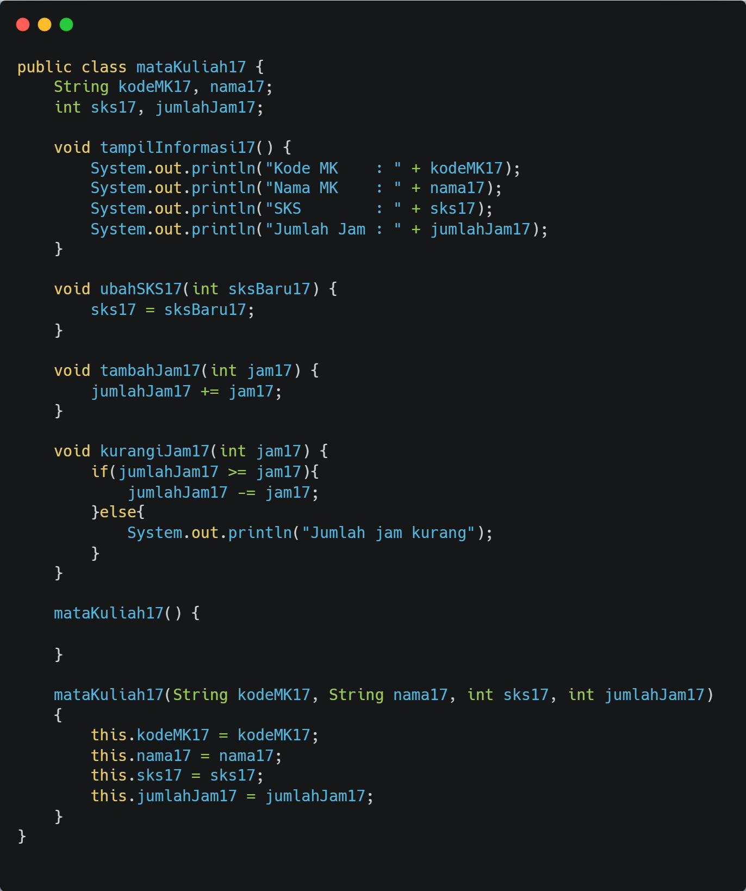

      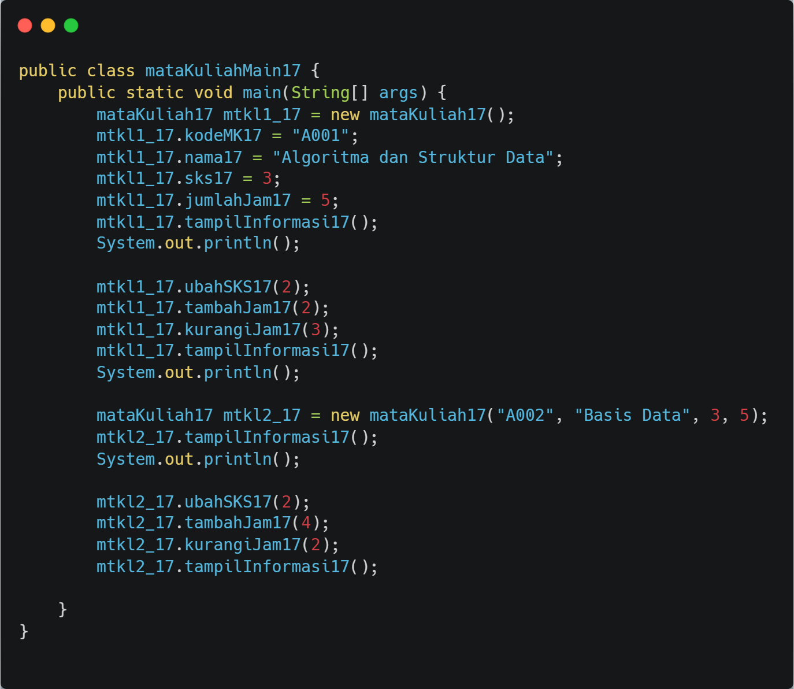

      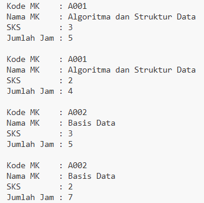

      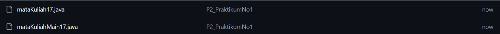

   2. Berikut kode dan hasilnya :

      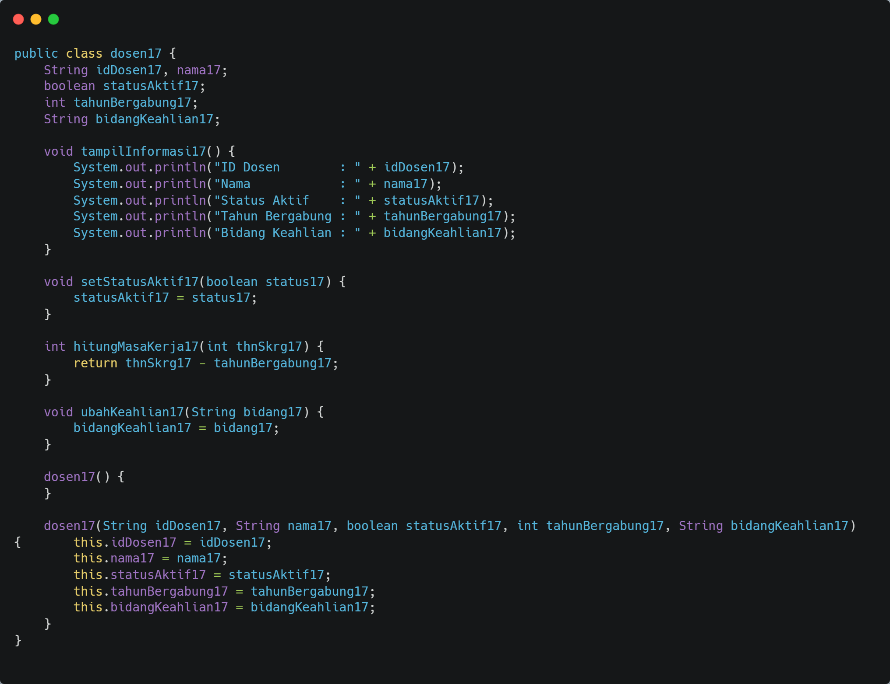

      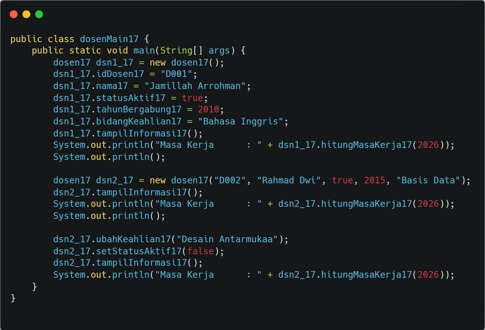

      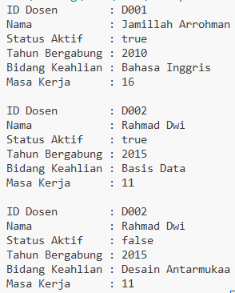

      