# Laporan Praktikum Dasar Pemrograman Jobsheet 3

<h4>Nama : Muhammad Nur Rochman<h4>
<h4>NIM : 254107020121<h4>
<h4>Kelas : TI-1E<h4>

## 3.2 Membuat Array dari Object, Mengisi dan Menampilkan

### 3.2.1 Langkah-langkah Percobaan

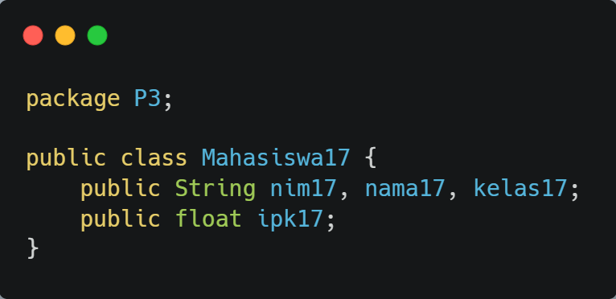

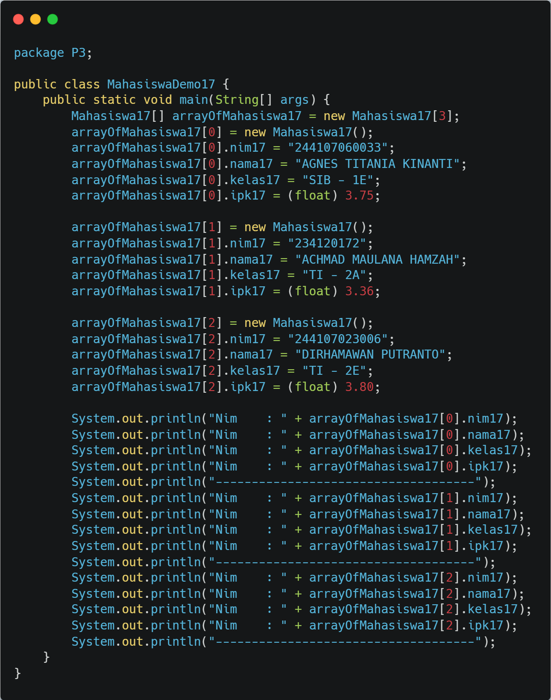

### 3.2.2 Verifikasi Hasil Percobaan

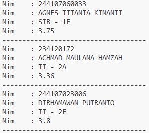

### 3.2.3 Pertanyaan

1. Berdasarkan uji coba 3.2, apakah class yang akan dibuat array of object harus selalu memiliki atribut dan sekaligus method? Jelaskan!
2. Apa yang dilakukan oleh kode program berikut?

   

3. Apakah class Mahasiswa memiliki konstruktor? Jika tidak, kenapa bisa dilakukan pemanggilan konstruktur pada baris program berikut?

   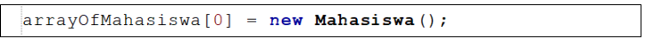

4. Apa yang dilakukan oleh kode program berikut?

   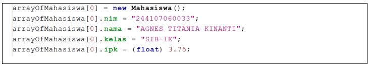

5. Mengapa class Mahasiswa dan MahasiswaDemo dipisahkan pada uji coba 3.2?

### Jawaban

1. Tidak harus, dari percobaan tersebut cuma memiliki atribut saja seperti nim17, nama17, kelas17 dan ipk17. walaupun tidak ada method tetapi bisa dibuat array object.
2. Deklarasi dan alokasi array
3. Tidak ada konstruktor yanng didefinisikan, tetapi bija jalan karena java otomatis menyediakan konstruktor default
4. Inisialisasi data mahasiswa pertama/index 0 dalam array object
5. Karena OOP, Mahasiswa sebagai class model yang berisi atribut dan MahasiswaDemo sebagai main

## 3.3 Menerima Input Isian Array Menggunakan Looping

### 3.3.1 Langkah-langkah Percobaan

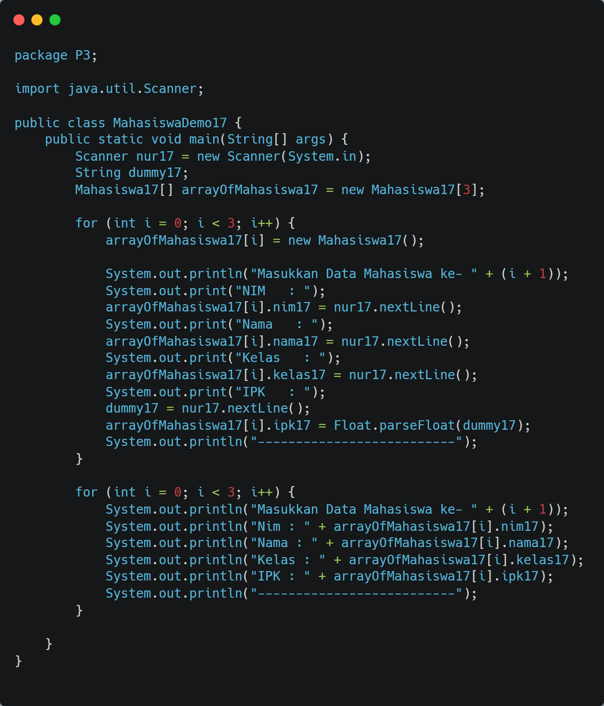

### 3.3.2 Verifikasi Hasil Percobaan

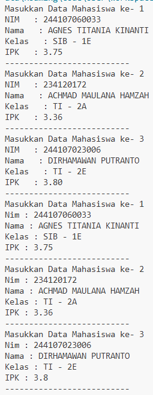

### 3.3.3 Pertanyaan

1.  Tambahkan method cetakInfo() pada class Mahasiswa kemudian modifikasi kode program
    pada langkah no 3.
2.  Misalkan Anda punya array baru bertipe array of Mahasiswa dengan nama
    myArrayOfMahasiswa. Mengapa kode berikut menyebabkan error?

        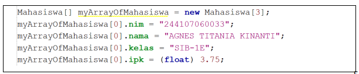

### Jawaban

1. Berikut kode dan hasilnya

   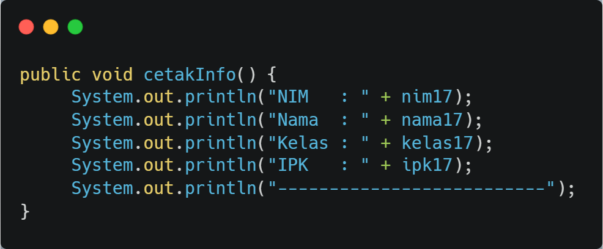

   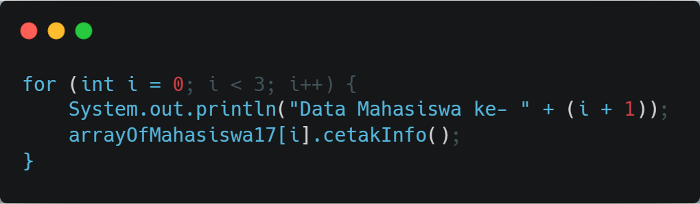

   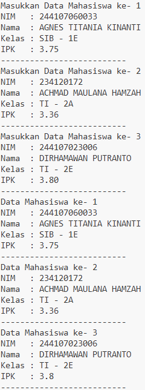

2. Karena objek Mahasiswa17 belum diinstansiasi

## 3.4 Constructor Berparameter

### 3.4.1 Langkah-langkah Percobaan

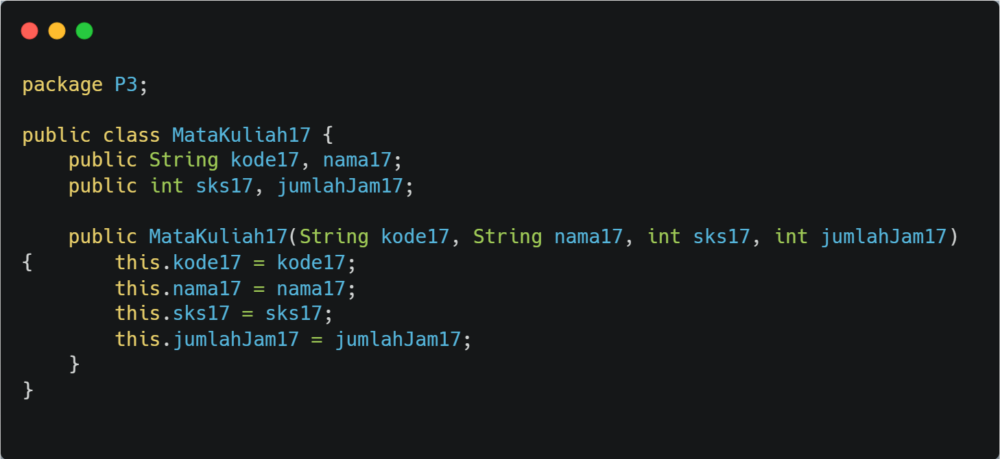

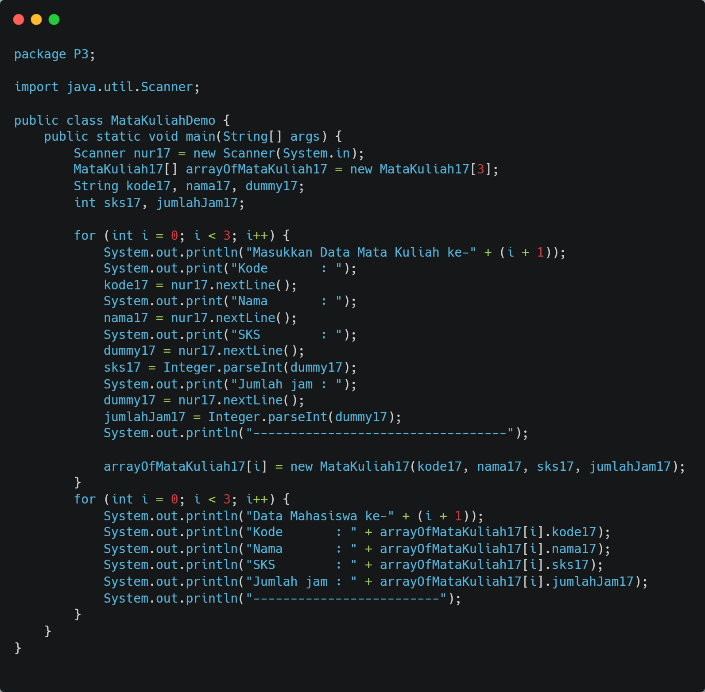

### 3.4.2 Verifikasi Hasil Percobaan

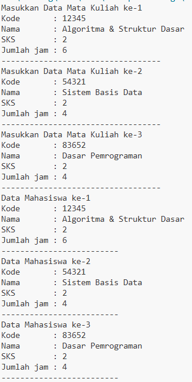

### 3.4.3 Pertanyaan

1. Apakah suatu class dapat memiliki lebih dari 1 constructor? Jika iya, berikan contohnya
2. Tambahkan method tambahData() pada class Matakuliah, kemudian gunakan method
   tersebut di class MatakuliahDemo untuk menambahkan data Matakuliah
3. Tambahkan method cetakInfo() pada class Matakuliah, kemudian gunakan method
   tersebut di class MatakuliahDemo untuk menampilkan data hasil inputan di layar
4. Modifikasi kode program pada class MatakuliahDemo agar panjang (jumlah elemen) dari
   array of object Matakuliah ditentukan oleh user melalui input dengan Scanner

### Jawaban

1. Ya, suatu class dapat memiliki lebih dari satu constructor(overloading) contoh :

   

   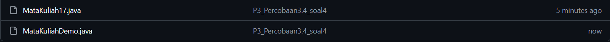

2. Berikut kodenya :

   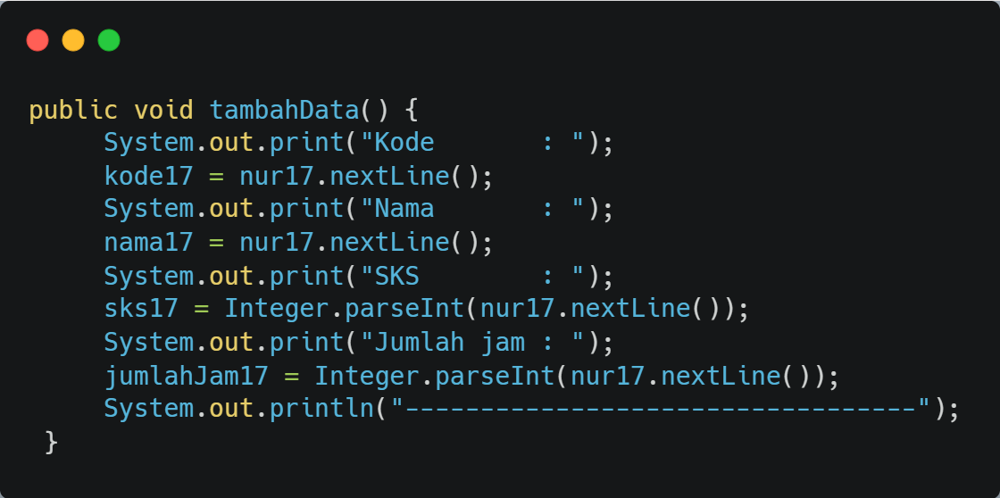

   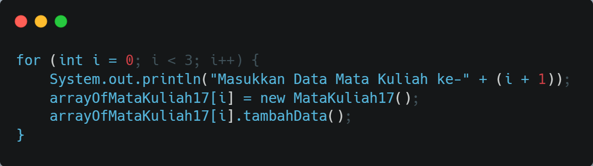

3. Berikut kodenya :

   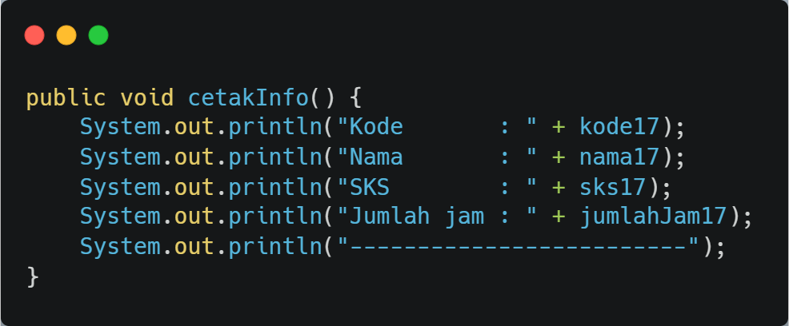

   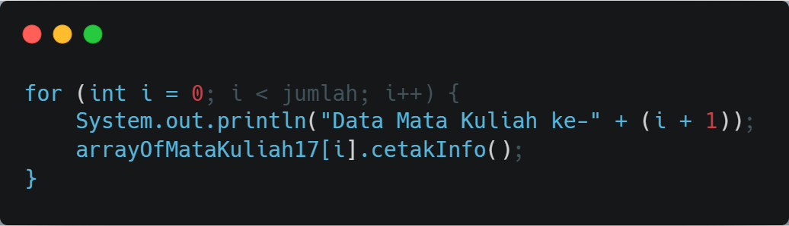

4. Berikut kodenya :

   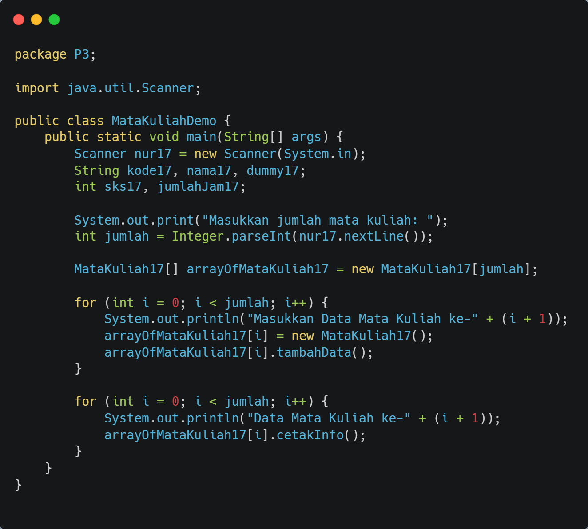

   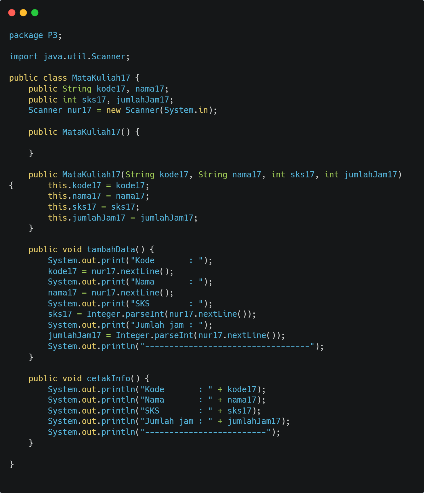

## 3.5 Tugas

### Soal

1.  Buatlah program untuk menampilkan informasi tentang dosen. Program dapat menerima input
    semua informasi terkait dosen dan menampilkanya kembali ke layar. Program ini terdiri dari class
    Dosen<NoPresensi> dengan attribute/property sebagai berikut;
    String kode
    String nama
    Boolean jenisKelamin
    int usia
    dengan methode constructor sebagai berikut;
    public dosen(String kode, String nama, Boolean jenisKelamin, int usia) {
    …………….;
    …………….;
    }
    Kemudian buatlah class DosenDemo<NoPresensi> untuk proses input dan menampilkan data
    beberapa dosen. Gunakan looping dengan FOR untuk pembuatan array of object. Gunakan
    looping dengan FOREACH untuk menampilkan data ke layar.
2.  Tambahkan class baru DataDosen<NoPresensi> dengan beberapa method berikut;
    - dataSemuaDosen(Dosen[] arrayOfDosen)untuk menampilkan data semua dosen
    - jumlahDosenPerJenisKelamin(Dosen[] arrayOfDosen) untuk menampilkan data
      jumlah dosen per jenis kelamin (Pria / Wanita)
    - rerataUsiaDosenPerJenisKelamin(Dosen[] arrayOfDosen) untuk menampilkan
      rata-rata usia dosen per jenis kelamin (Pria / Wanita)
    - infoDosenPalingTua(Dosen[] arrayOfDosen) untuk menampilkan data dosen paling
      tua
    - infoDosenPalingMuda(Dosen[] arrayOfDosen) untuk menampilkan data dosen paling
      muda

### Jawaban

1. Kode dan hasilnya :

   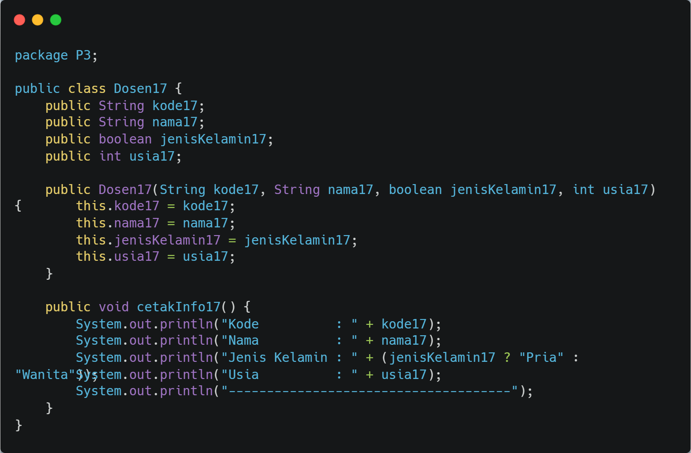

   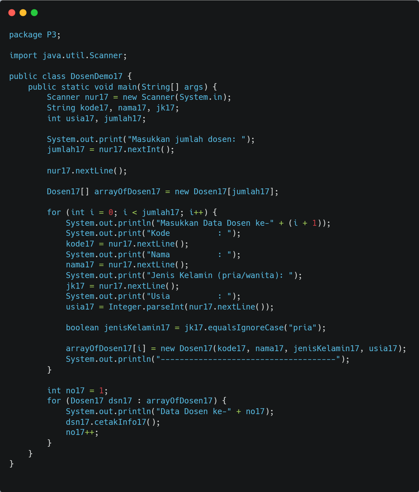

   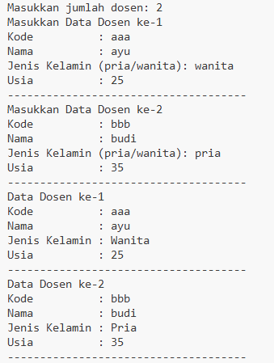

   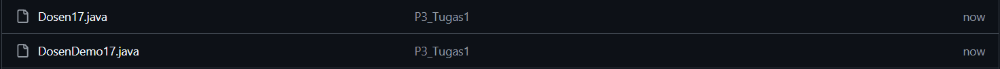

2. Kode dan hasilnya :
   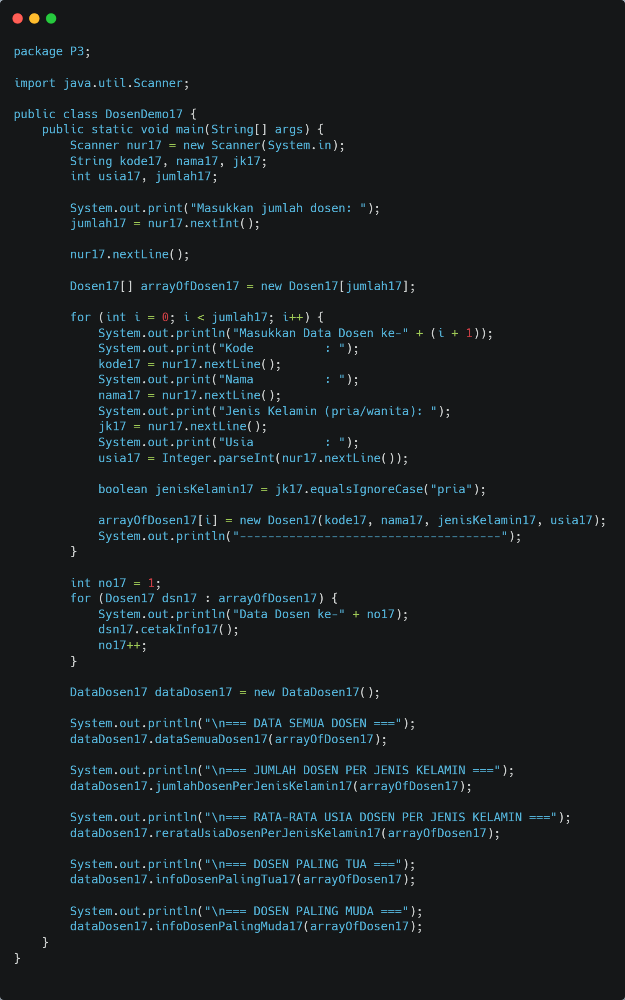

   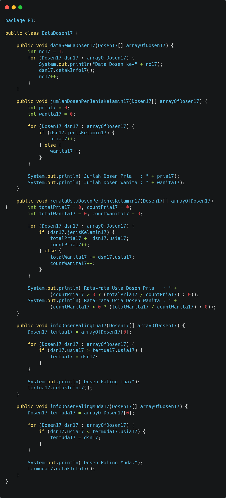

   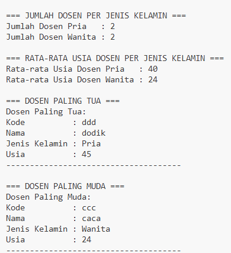
