# Laporan ASD Jobsheet 5

<h4>Nama : Muhammad Nur Rochman<h4>
<h4>NIM : 254107020121<h4>
<h4>Kelas : TI-1E<h4>

## 5.2 Menghitung Nilai Faktorial dengan Algoritma Brute Force dan Divide and Conquer

### 5.2.1 Langkah-langkah Percobaan
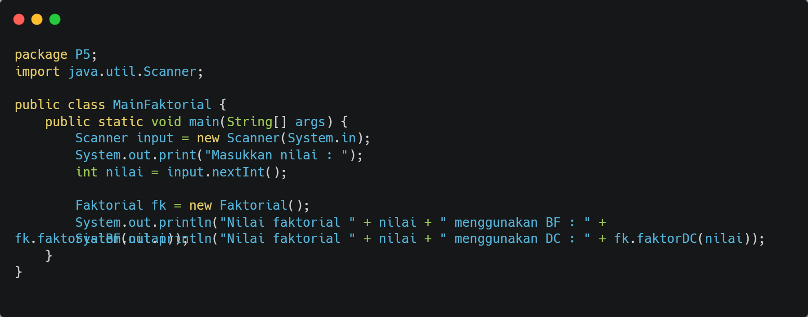
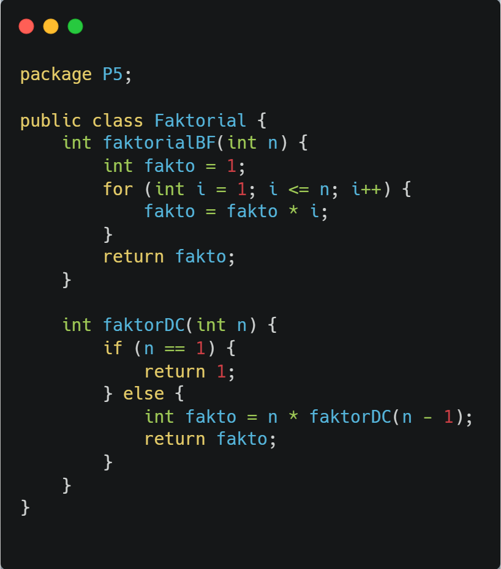

### 5.2.2 Verifikasi Hasil Percobaan
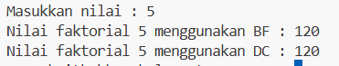

### 5.2.3 Pertanyaan
1. Pada bagian if berisi basecase yaitu kondisi akhir dari rekursif, sedangkan pada bagian else merupakan bagian rekursif yang memanggil fungsi kembali dengan nilai yang lebih kecil.
2. Bisa, kita ambil contoh pakai while :
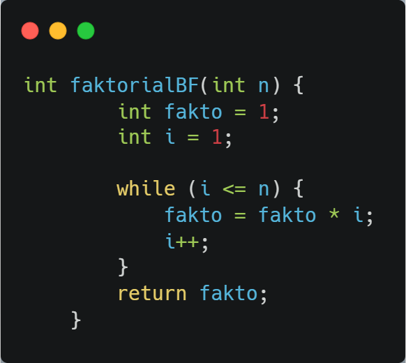

3. - fakto *= i; ===> Iterasi (Brute Force), 
   - n * faktorialDC(n-1); ===> Rekursi (Divide and Conquer). 
4. - Brute Force ===> Menggunakan metode perulangan dengan cara linear dan penggunaannya lebih sederhana.
   - Divide and Conquer ===> Menggunakan metode rekursif dengan cara membagi case agar menjadi efisien.

## 5.3 Menghitung Hasil Pangkat dengan Algoritma Brute Force dan Divide and Conquer

### 5.3.1 Langkah-langkah Percobaan
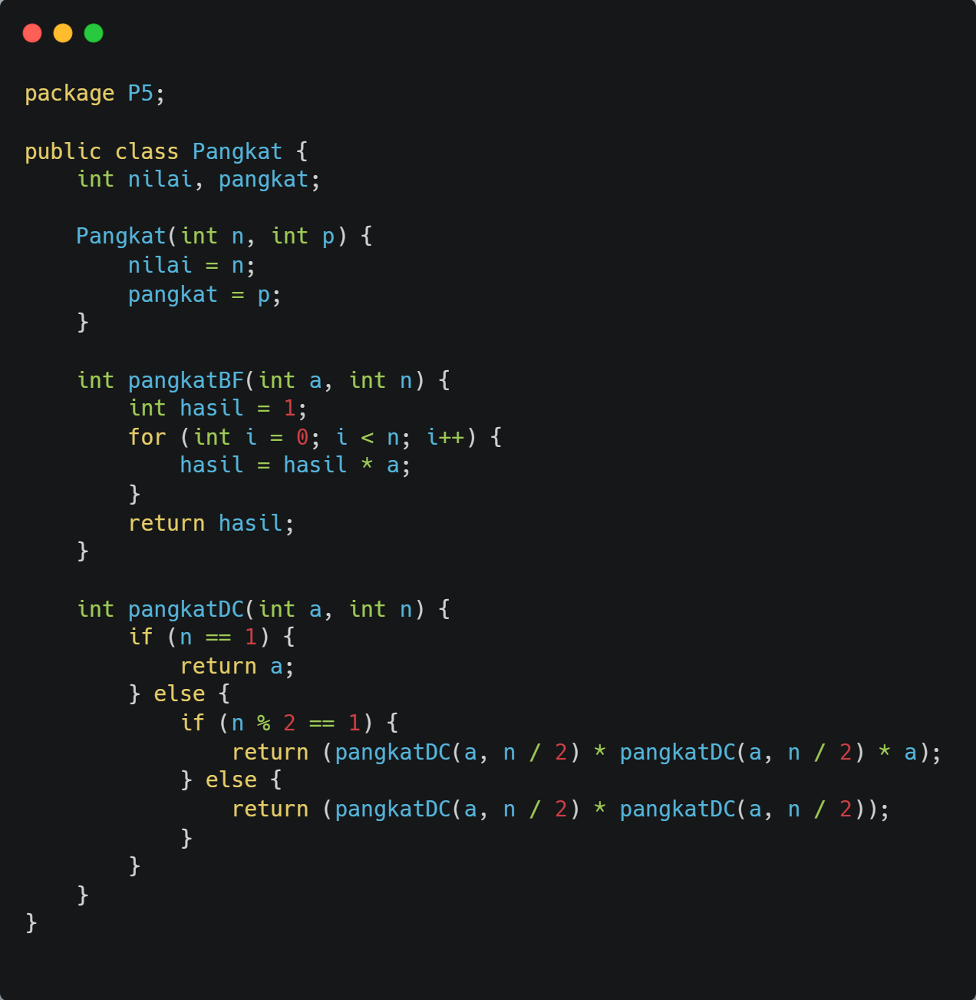
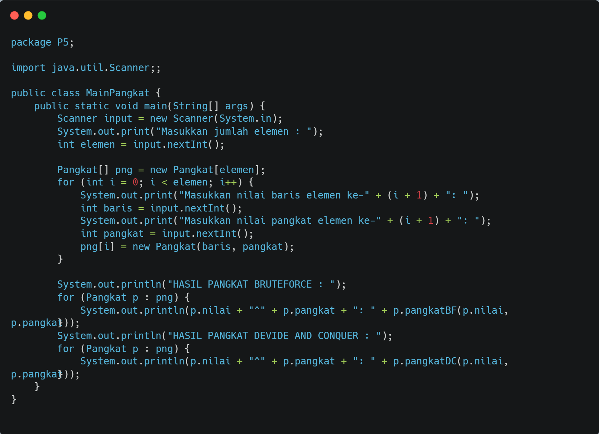

### 5.3.2 Verifikasi Hasil Percobaan
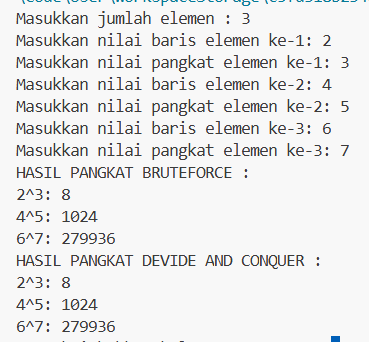

### 5.3.3 Pertanyaan
1. - pangkatBF() ===> menggunakan perulangan (iteratif/brute force)
   - pangkatDC() ===> menggunakan rekursif (devide and conquer)
2. Iya ada, contohnya pada kode : return a * pangkatDC(a,n-1); yang mana hasil dari rekursi dikalikan kembali untuk membentuk hasil akhir
3. Parameter masih releban karena nilai bisa dikirim dari luar method, tetapi juga bisa tanpa parameter. Kodenya seperti di bawah ini :
 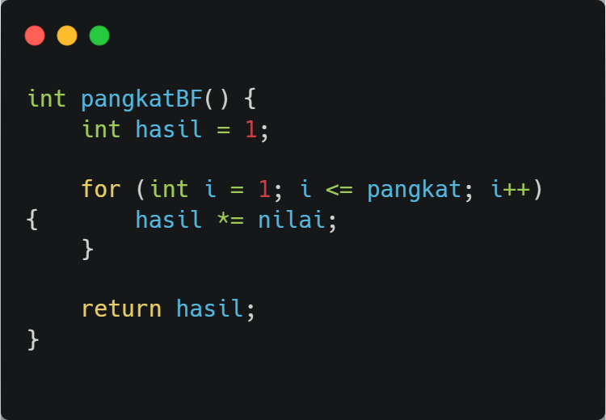
4. - pangkatBF ===> menghitung pangkat dengan perulangan iterasi
   - pangkatDC ===> menghitung pangkat dengan rekursi yaitu memecah masalah menjadi bagian yang lebih kecil

## 5.4 Menghitung Sum Array dengan Algoritma Brute Force dan Divide and Conquer

### 5.4.1 Langkah-langkah Percobaan
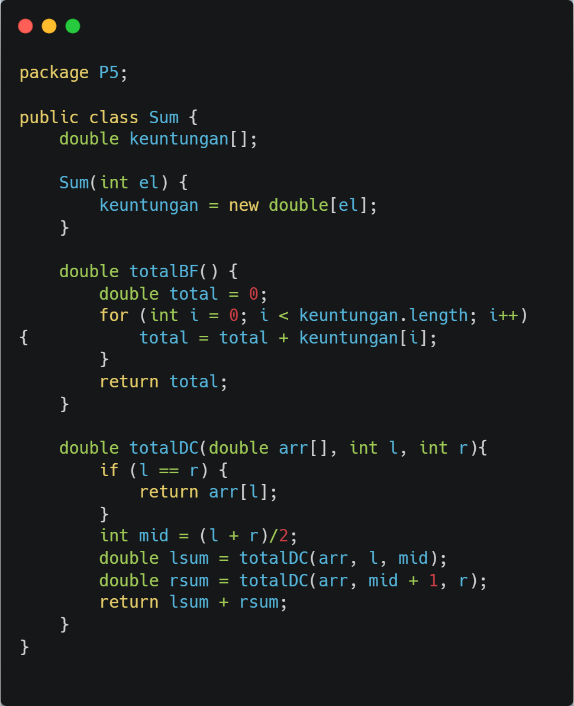
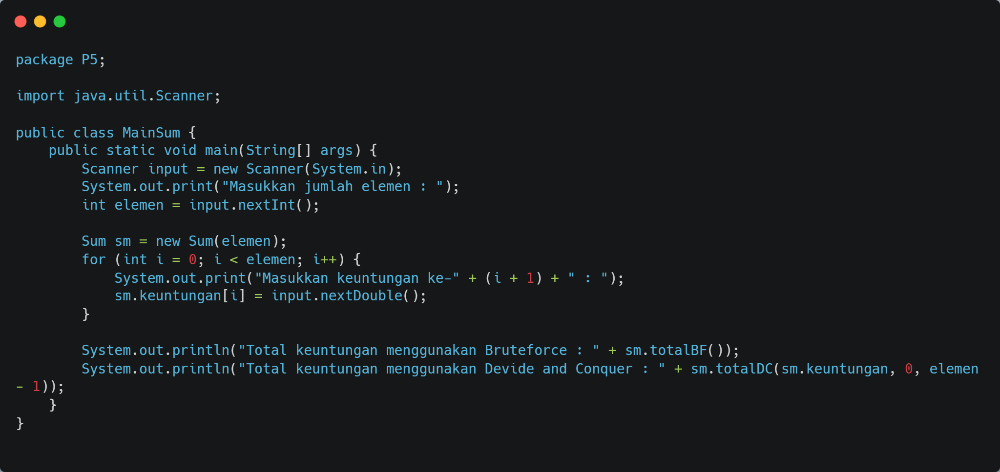

### 5.4.2 Verifikasi Hasil Percobaan
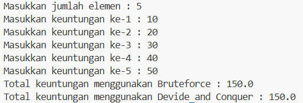

### 5.4.3 Pertanyaan
1. Mid digunakan untuk membagi array menjadi 2 bagian(devide and conquer)
2. Untuk menghitung jumlah bagian kiri dan kanan array secara rekursif
3. Untuk menggabungkan hasil dua bagian array(tahap combine dalam devide and conquer)
4. Basecasenya adalah if(l==r) return arr[l]; ketika array hanya punya 1 elemen maka rekursi berhenti
5. - array dibagi menjadi dua bagian
   - masing2 bagian dihitung rekursif
   - hasil kiri dan kanan dijumlahkan kembali

## 4.5 Latihan Praktikum
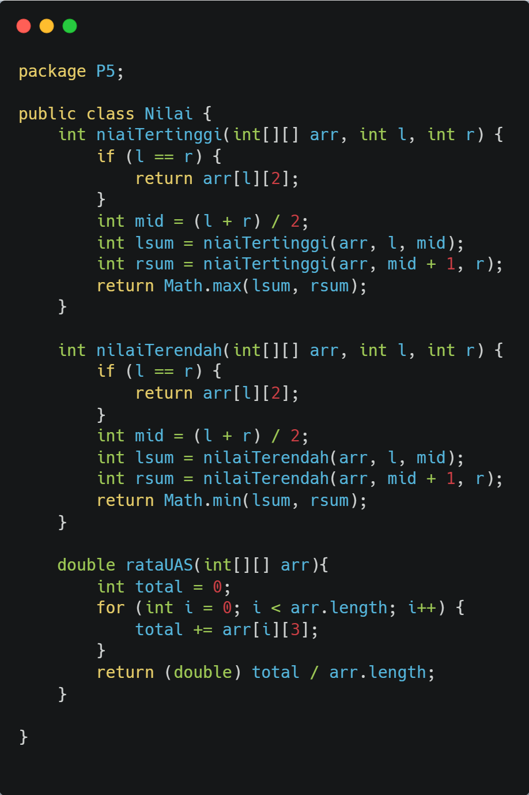
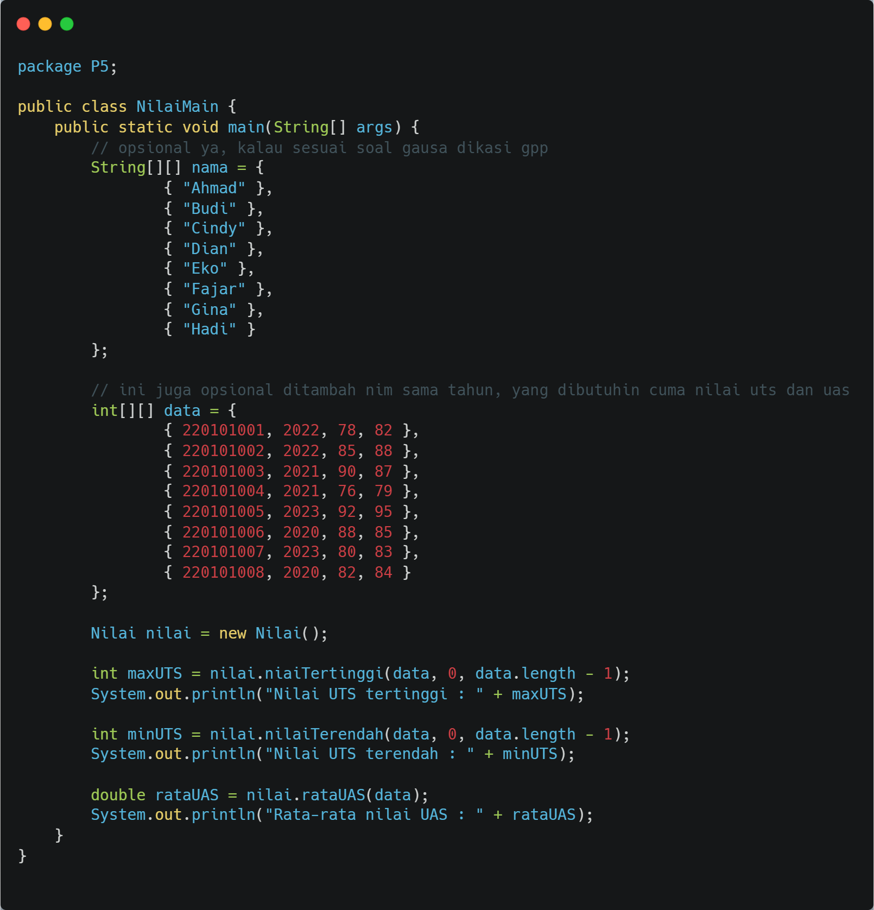
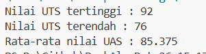

