# Laporan ASD Jobsheet 9

<h4>Nama : Muhammad Nur Rochman<h4>
<h4>NIM : 254107020121<h4>
<h4>Kelas : TI-1E<h4>

## 2.1 Percobaan 1: Mahasiswa Mengumpulkan Tugas
### 2.1.1 Langkah-langkah Percobaan

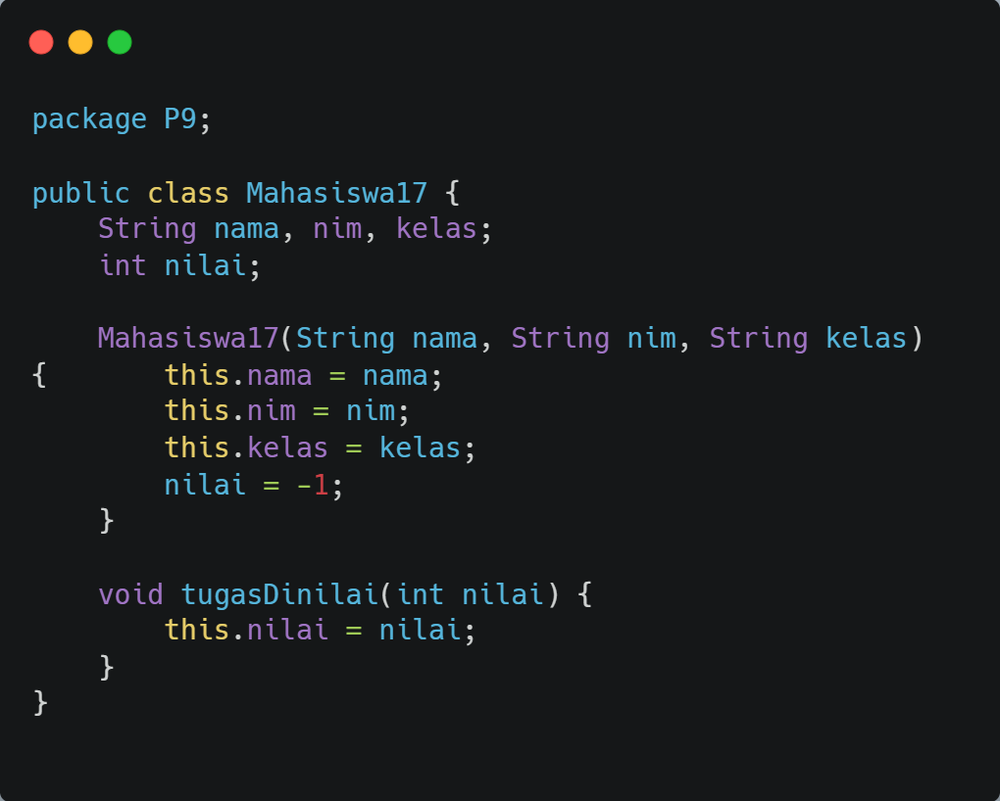

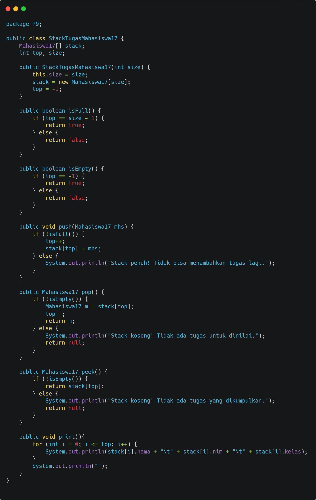

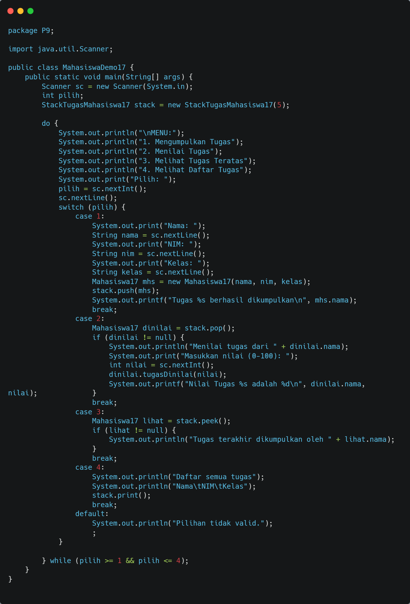

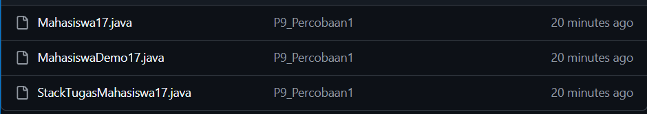

### 2.1.2 Verifikasi Hasil Percobaan

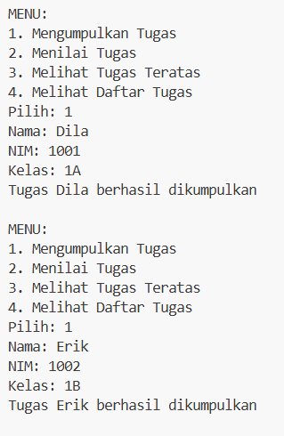

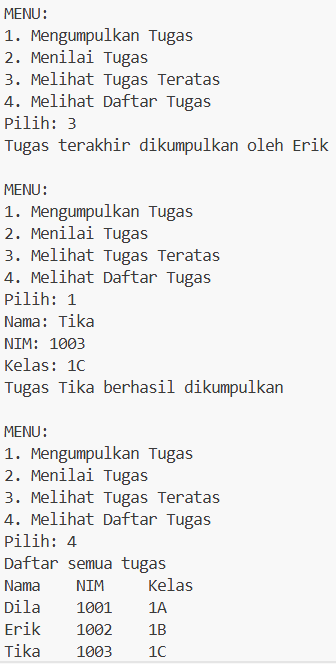

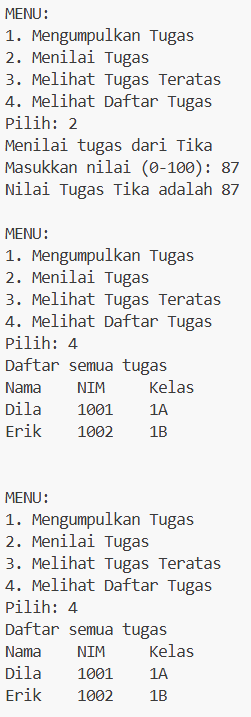

### 2.1.3 Pertanyaan
1. Ganti for di print dengan : int i = top; i >= 0; i--.
2. Maksimal 5 data, kodenya : StackTugasMahasiswa stack = new StackTugasMahasiswa(5);.
3. Agar tidak overflow (kelebihan array).
4. Pada MahasiswaDemo :

   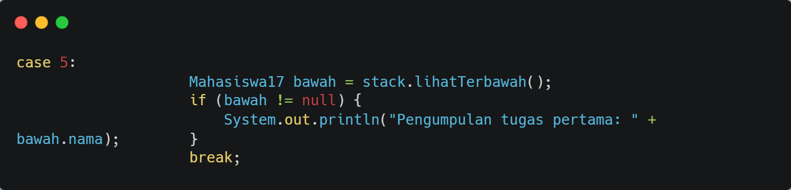

   Pada StackTugas :

   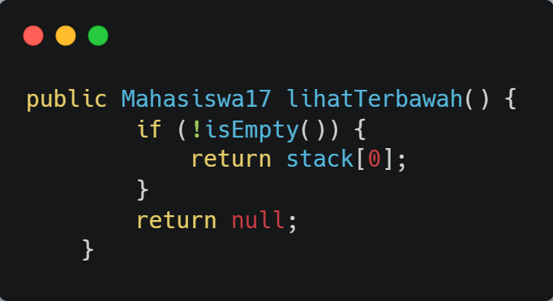
   
5. Pada MahasiswaDemo :

   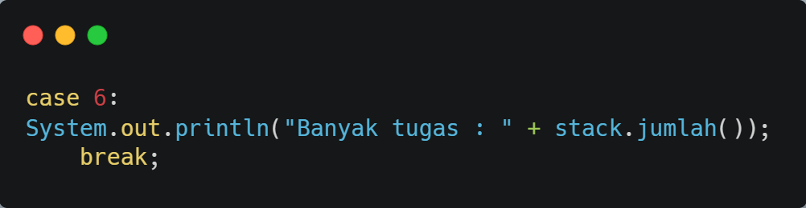

   Pada StackTugas :

   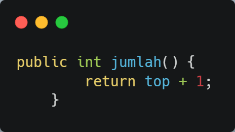

6. Push Github

   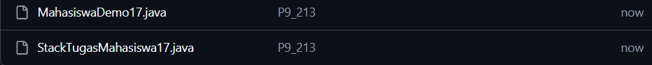

## 2.2 Percobaan 2: Konversi Nilai Tugas ke Biner
### 2.2.1 Langkah-langkah Percobaan

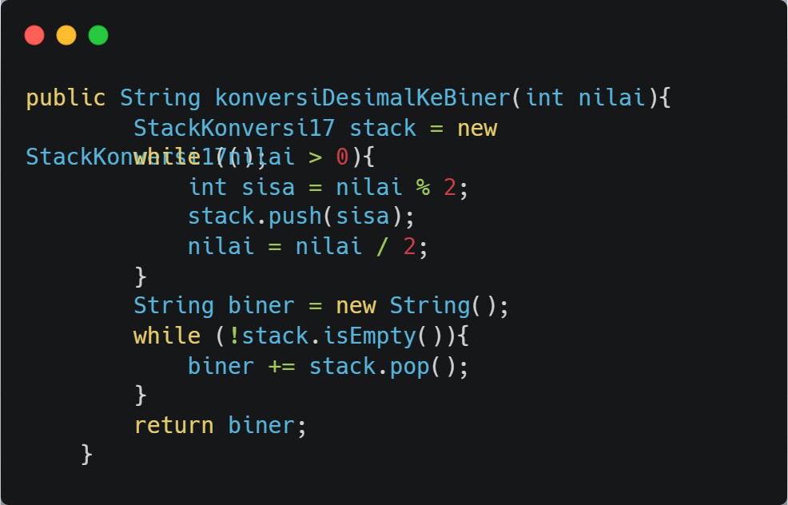

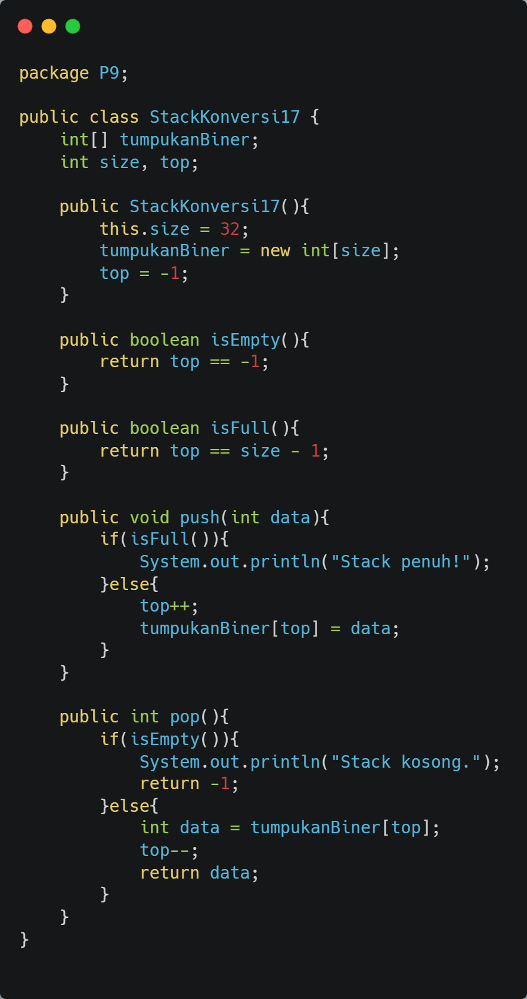

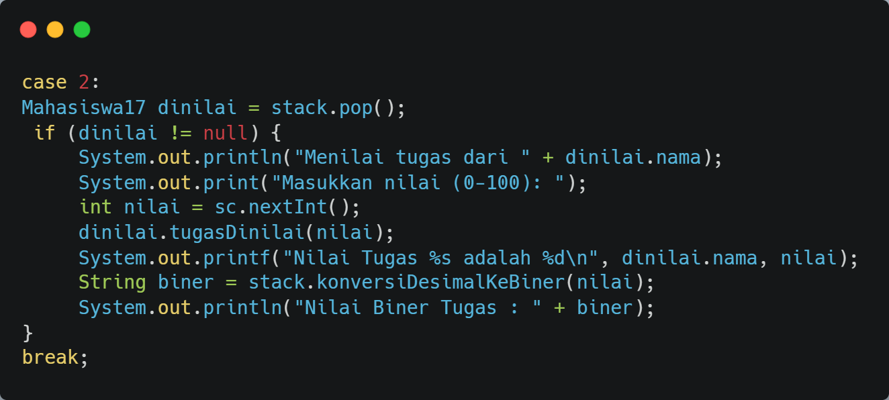

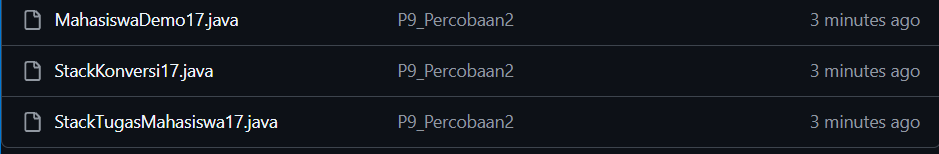

### 2.2.2 Verifikasi Hasil Percobaan

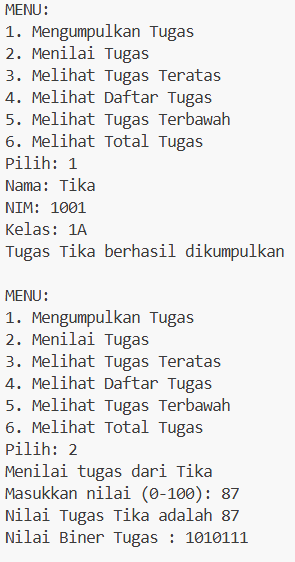

### 2.2.3 Pertanyaan
1. Alur kerja konversi
   - Bagi angka dengan 2
   - Simpan sisa ke stack
   - Ulang sampai habis
   - Ambil dari stack → jadi biner
   karena stack = LIFO, hasil jadi terbalik otomatis benar.
2. Jika pakai while(kode != 0)
   - Hasil tetap sama
   - Karena loop berhenti saat kode = 0
   - Bedanya >0 lebih aman untuk bilangan positif, !=0 bisa handle kondisi lain. 
## 2.4 Latihan Praktikum
1. Kode

   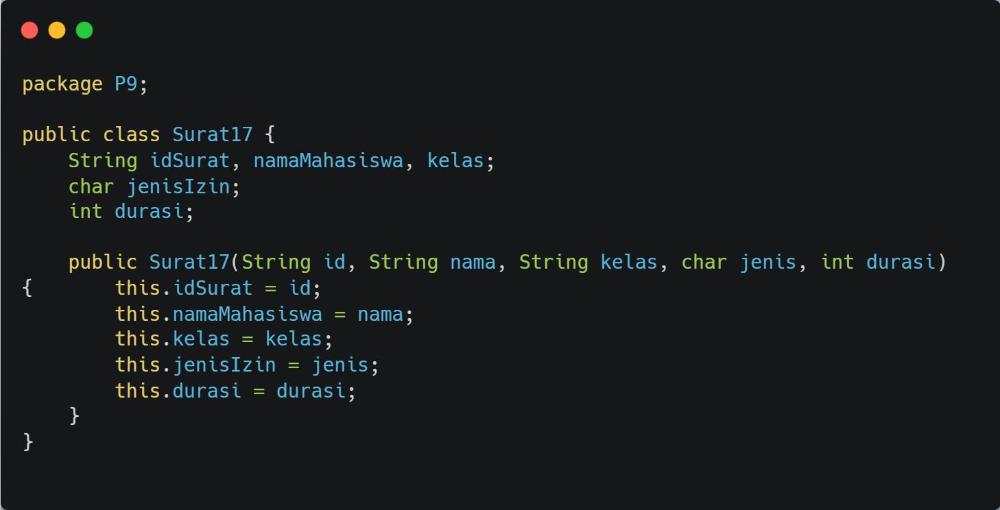

   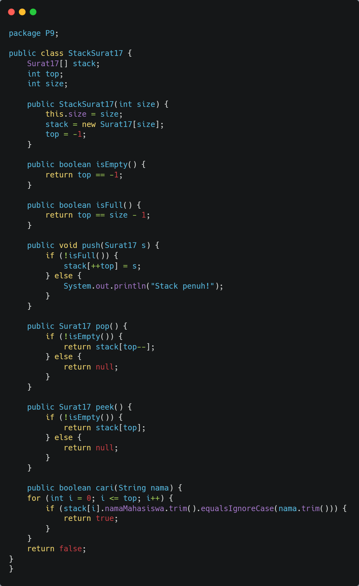

   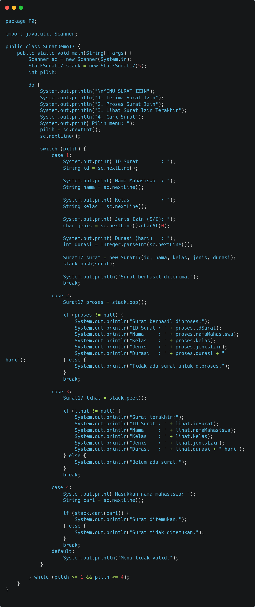

2. Hasil

   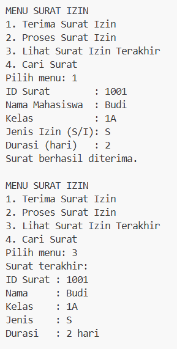

   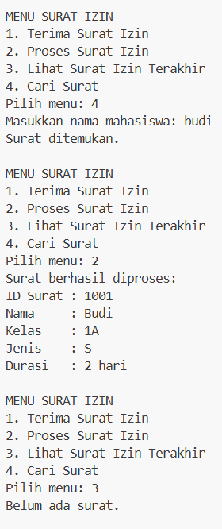

   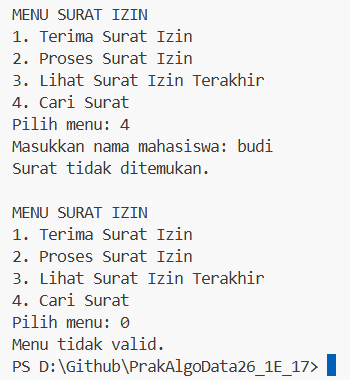

3. Github

   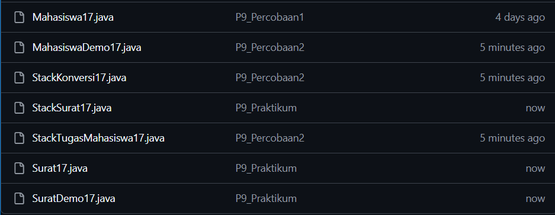

