# Laporan ASD Jobsheet 14

<h4>Nama : Muhammad Nur Rochman<h4>
<h4>NIM : 254107020121<h4>
<h4>Kelas : TI-1E<h4>

## 13.2 Persiapan

Kode :

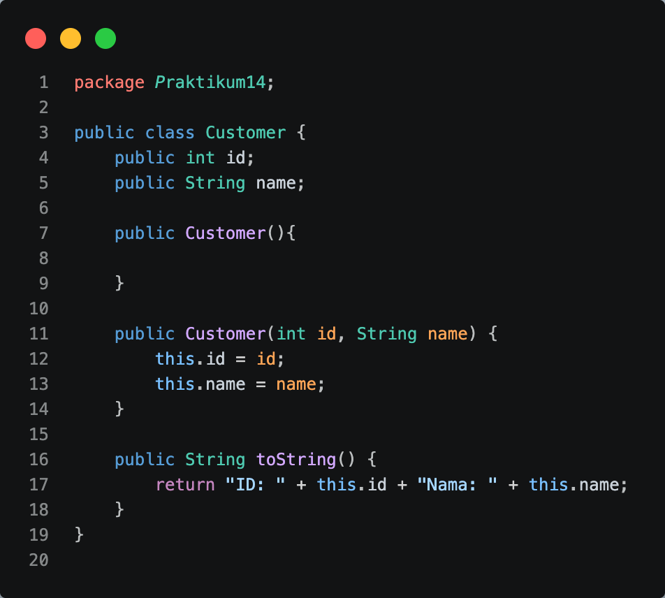

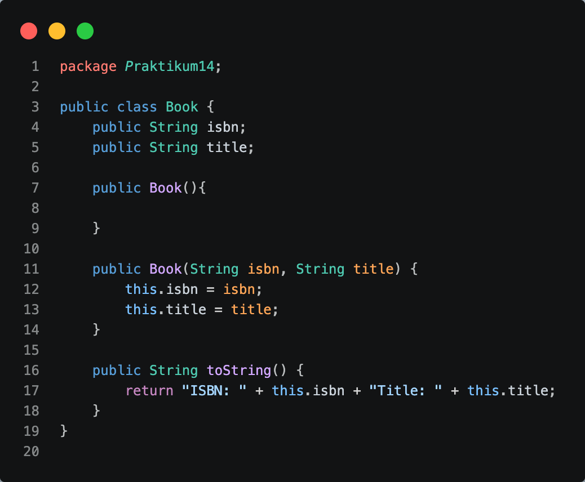

## 13.3 Praktikum - Implementasi ArrayList

Kode:

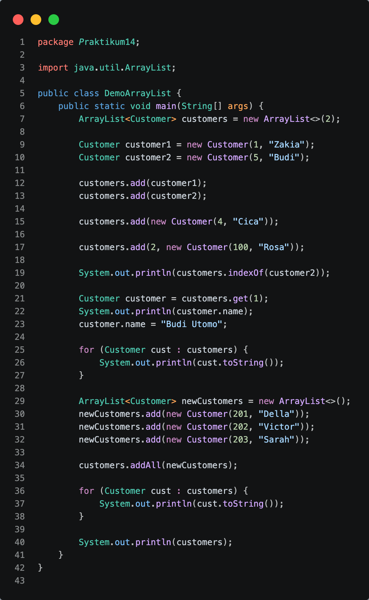

Hasil:

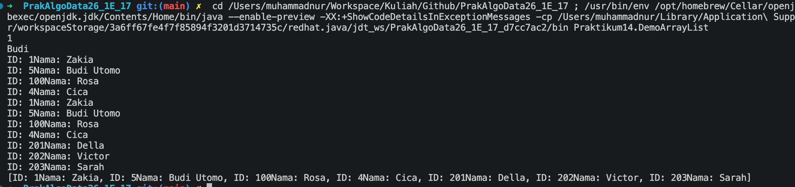

Soal no 5:

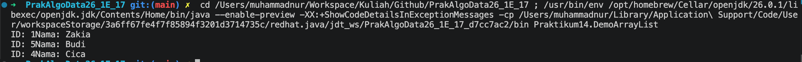

Soal no 7:

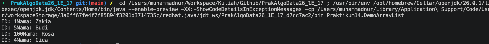

soal no 10:

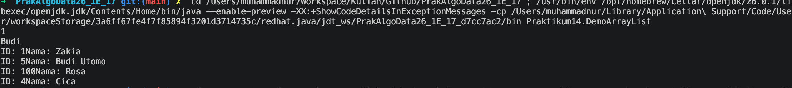

## 13.4 Praktikum - Implementasi Stack

Kode:

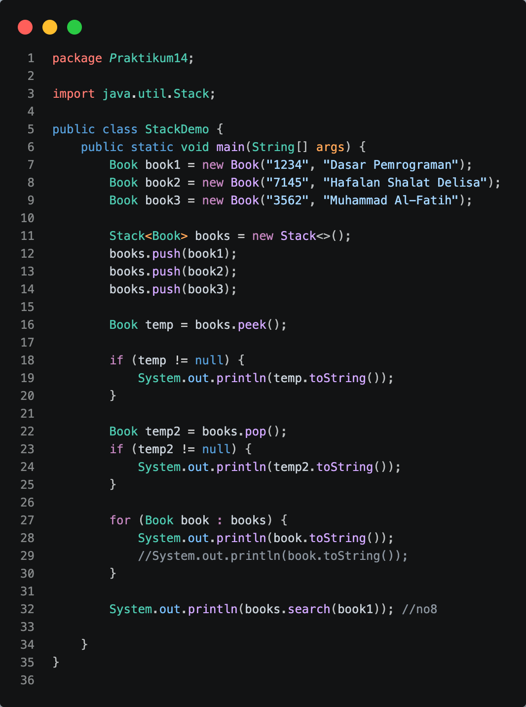

Hasil:

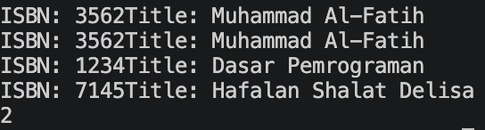

Soal no 5:
Untuk memastikan data hasil pop() ada sehingga tidak terjadi error saat digunakan.

Soal no 8:

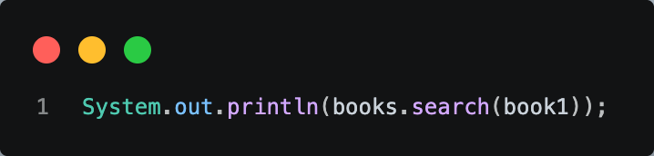

## 13.5 Praktikum - Implementasi TreeSet

Kode:

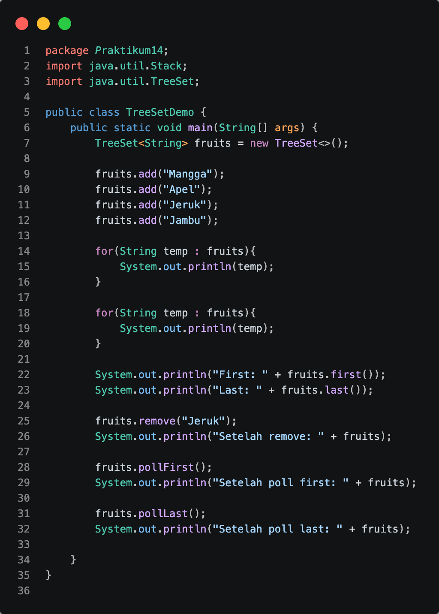

Hasil:

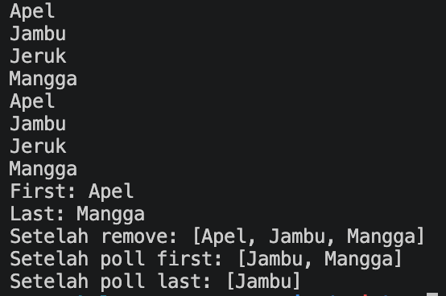

soal no 4:
Karena TreeSet mengurutkan data secara otomatis (ascending/alphabet).

soal no 6:
first(): Mengambil data pertama
last(): Mengambil data terakhir
remove(): Menghapus elemen tertentu
pollFirst(): Mengambil dan menghapus elemen pertama
pollLast(): Mengambil dan menghapus elemen terakhir

## 13.6 Praktikum – Sorting

Kode:

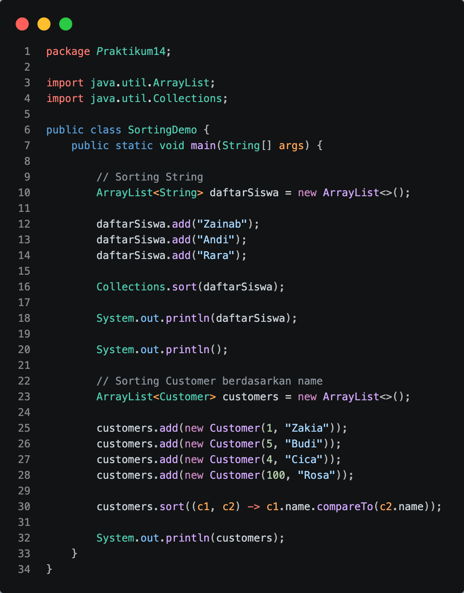

Hasil:

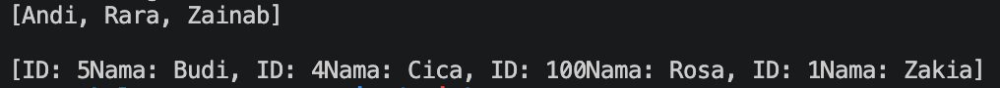
